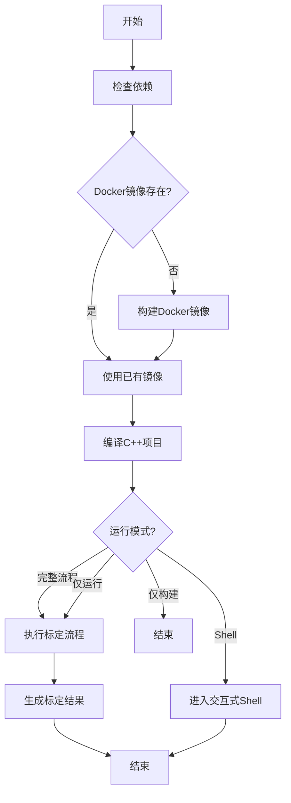

# 一键编译和运行指南

## 概述

`build_and_run.sh` 是一个自动化脚本，用于简化和统一整个标定系统的编译和运行流程。

## 功能特性

- ✅ 自动检查依赖环境（Docker、GPU、X11）
- ✅ 自动构建 Docker 镜像（如果不存在）
- ✅ 自动编译 C++ 主框架（unicalib_C_plus_plus）
- ✅ 一键执行完整标定流程
- ✅ 支持交互式 Shell 调试
- ✅ 灵活的数据/结果目录配置

## 环境要求

### 必需依赖

- **Docker**: ≥ 20.10
- **nvidia-docker**: 用于 GPU 支持
- **NVIDIA 驱动**: ≥ 525.x (CUDA 11.8 兼容)

### 可选依赖

- **X11**: 用于 GUI 可视化（RViz2 等）
- **SSH**: 用于远程调试

## 快速开始

### 1. 基础使用

```bash
# 赋予执行权限
chmod +x build_and_run.sh

# 完整流程：构建镜像 → 编译C++ → 运行标定
./build_and_run.sh
```

### 2. 仅构建

```bash
# 仅构建 Docker 镜像和 C++ 代码，不运行标定
./build_and_run.sh --build-only
```

### 3. 仅运行

```bash
# 仅运行标定（假设已构建完成）
./build_and_run.sh --run-only
```

### 4. 交互式 Shell

```bash
# 进入容器交互式 Shell
./build_and_run.sh --shell
```

## 配置选项

### 环境变量

| 变量名 | 默认值 | 说明 |
|--------|--------|------|
| `CALIB_DATA_DIR` | `/tmp/calib_data` | 标定数据目录 |
| `CALIB_RESULTS_DIR` | `/tmp/calib_results` | 标定结果目录 |
| `AUTO_BUILD_LIVOX` | `0` | 是否自动编译 livox 驱动 |

### 使用示例

```bash
# 自定义数据目录
CALIB_DATA_DIR=/path/to/my/data ./build_and_run.sh

# 自定义结果目录
CALIB_RESULTS_DIR=/path/to/my/results ./build_and_run.sh

# 启用自动编译 livox 驱动
AUTO_BUILD_LIVOX=1 ./build_and_run.sh

# 组合使用
CALIB_DATA_DIR=/data \
CALIB_RESULTS_DIR=/output \
AUTO_BUILD_LIVOX=1 \
./build_and_run.sh
```

## 目录结构

```
calibration/
├── build_and_run.sh          # 一键编译和运行脚本
├── unicalib_C_plus_plus/     # C++ 主框架
│   ├── CMakeLists.txt
│   ├── config/
│   │   └── sensors.yaml      # 传感器配置文件
│   └── src/
├── docker/
│   ├── Dockerfile
│   └── docker_build.sh       # Docker 镜像构建脚本
├── UniCalib/                 # Python 参考实现（不参与主流程）
└── data/                     # 标定数据目录（软链接或实际目录）
```

## 数据准备

### 数据目录结构

标定数据目录应包含以下结构：

```
data/
├── camera/                   # 相机数据
│   ├── cam0/
│   │   ├── images/           # 图像序列
│   │   └── timestamps.txt   # 时间戳文件
│   └── cam1/
│       ├── images/
│       └── timestamps.txt
├── lidar/                    # 激光雷达数据
│   ├── points/
│   │   ├── scan001.pcd
│   │   ├── scan002.pcd
│   │   └── ...
│   └── timestamps.txt
└── calibration_pattern/      # 标定板数据（如有）
    └── pattern.yaml
```

### 配置文件

主要配置文件：`unicalib_C_plus_plus/config/sensors.yaml`

示例配置：

```yaml
sensors:
  camera_0:
    type: "camera"
    name: "front_left"
    topic: "/camera/front_left/image_raw"
  camera_1:
    type: "camera"
    name: "front_right"
    topic: "/camera/front_right/image_raw"
  lidar_0:
    type: "lidar"
    name: "livox"
    topic: "/livox/lidar"

calibration:
  target_type: "chessboard"
  pattern_size: [9, 6]
  square_size: 0.1  # meters
```

## 工作流程



## 常见问题

### 1. Docker 镜像构建失败

**问题**: 构建过程中网络下载失败

**解决方案**:
```bash
# 使用项目提供的本地依赖
cd docker
./download_opencv_deps.sh
./docker_build.sh --build-only
```

### 2. C++ 编译失败

**问题**: 编译时出现依赖错误

**解决方案**:
```bash
# 进入容器 Shell 查看详细错误
./build_and_run.sh --shell

# 手动编译查看详细输出
cd /root/calib_ws/unicalib_C_plus_plus
mkdir -p build && cd build
cmake .. -DCMAKE_BUILD_TYPE=Debug
make -j1 VERBOSE=1
```

### 3. 标定运行失败

**问题**: 数据路径或格式错误

**解决方案**:
```bash
# 检查数据目录结构
tree /path/to/calib_data

# 验证配置文件
cat unicalib_C_plus_plus/config/sensors.yaml

# 使用 Shell 调试
./build_and_run.sh --shell
cd /root/calib_ws/unicalib_C_plus_plus/build
./unicalib_example ../config/sensors.yaml /root/calib_ws/data --verbose
```

### 4. GPU 不可用

**问题**: 无法使用 GPU 加速

**解决方案**:
```bash
# 检查 nvidia-docker 安装
docker run --rm --gpus all nvidia/cuda:11.8.0-base-ubuntu22.04 nvidia-smi

# 如果未安装，参考官方文档安装
# https://docs.nvidia.com/datacenter/cloud-native/container-toolkit/install-guide.html
```

### 5. X11 GUI 不可用

**问题**: 无法打开 GUI 窗口（如 RViz2）

**解决方案**:
```bash
# 允许本地 Docker 访问 X11
xhost +local:docker

# 检查 DISPLAY 环境变量
echo $DISPLAY

# 如果远程连接，使用 X11 转发
ssh -X user@host
```

## 高级用法

### 1. 容器内手动操作

```bash
# 进入容器 Shell
./build_and_run.sh --shell

# 在容器内重新编译
cd /root/calib_ws/unicalib_C_plus_plus/build
make clean && make -j$(nproc)

# 运行自定义配置
./unicalib_example /path/to/custom_config.yaml /path/to/custom_data
```

### 2. 并行编译

```bash
# 在容器内使用多核编译
cd /root/calib_ws/unicalib_C_plus_plus/build
make -j$(nproc)
```

### 3. 调试模式

```bash
# 编译 Debug 版本
cd /root/calib_ws/unicalib_C_plus_plus/build
cmake .. -DCMAKE_BUILD_TYPE=Debug
make -j$(nproc)

# 使用 gdb 调试
gdb --args ./unicalib_example ../config/sensors.yaml /root/calib_ws/data
```

### 4. 性能分析

```bash
# 使用 nvprof 分析 CUDA 性能
nvprof ./unicalib_example ../config/sensors.yaml /root/calib_ws/data

# 使用 perf 分析 CPU 性能
perf record -g ./unicalib_example ../config/sensors.yaml /root/calib_ws/data
perf report
```

## 验证环境

使用验证脚本检查环境：

```bash
# 进入容器 Shell
./build_and_run.sh --shell

# 运行环境验证
/opt/scripts/verify_env.sh

# 或运行测试环境脚本
/root/scripts/test_env.sh
```

## 输出结果

标定完成后，结果保存在 `${CALIB_RESULTS_DIR}`：

```
results/
├── intrinsic/               # 内参标定结果
│   ├── cam0_intrinsics.yaml
│   └── cam1_intrinsics.yaml
├── extrinsic/              # 外参标定结果
│   ├── cam0_to_lidar.yaml
│   └── cam1_to_lidar.yaml
├── refined_extrinsic/       # 精外参结果
│   ├── cam0_to_lidar_refined.yaml
│   └── cam1_to_lidar_refined.yaml
└── logs/                   # 运行日志
    ├── calibration.log
    └── error.log
```

## 清理

```bash
# 清理 Docker 容器
docker-compose -f docker/docker-compose.yaml down --remove-orphans

# 清理标定结果
rm -rf /tmp/calib_results/*

# 清理编译缓存
cd unicalib_C_plus_plus/build
make clean
```

## 性能优化建议

1. **使用 SSD 存储数据**: 减少 I/O 瓶颈
2. **增加并行编译**: 使用 `make -j$(nproc)`
3. **启用 GPU 加速**: 确保 nvidia-docker 正确配置
4. **调整数据预加载**: 在配置文件中设置合理的预加载策略
5. **使用 Release 模式**: 生产环境使用 `-DCMAKE_BUILD_TYPE=Release`

## 技术支持

- **主文档**: [README.md](README.md)
- **C++框架文档**: [unicalib_C_plus_plus/README.md](unicalib_C_plus_plus/README.md)
- **构建文档**: [unicalib_C_plus_plus/BUILD_AND_RUN.md](unicalib_C_plus_plus/BUILD_AND_RUN.md)
- **Docker文档**: [docker/Dockerfile](docker/Dockerfile)

## 版本历史

| 版本 | 日期 | 说明 |
|------|------|------|
| 1.0.0 | 2024-02-28 | 初始版本，支持一键编译和运行 |
