# 外部工具编译指南

本文档说明如何使用 `build_external_tools.sh` 脚本编译和安装 UniCalib 的外部依赖项目。

## 📋 概述

UniCalib 集成了以下第三方标定工具：

| 工具 | 作用 | 语言 | 编译方式 |
|------|------|------|----------|
| **DM-Calib** | 针孔相机内参标定 | Python + PyTorch | pip install |
| **learn-to-calibrate** | IMU-LiDAR粗外参标定 | Python + PyTorch | pip install |
| **MIAS-LCEC** | LiDAR-Camera外参标定 | C++ + Python | setup.py |
| **iKalibr** | 多传感器联合优化 | ROS2 + C++ | colcon build |
| **click_calib** | Camera-Camera束调整 | Python | pip install |
| **Transformer-IMU-Calibrator** | IMU内参备选 | Python + PyTorch | pip install |

## 🚀 快速开始

### 方式1：通过主脚本编译（推荐）

```bash
# 编译所有外部工具 + C++主框架
./build_and_run.sh --build-only

# 或仅编译外部工具
./build_and_run.sh --build-external-only
```

### 方式2：直接使用编译脚本

```bash
# 编译所有检测到的工具
./build_external_tools.sh

# 仅检查工具状态，不编译
./build_external_tools.sh --check-only

# 仅编译特定工具
./build_external_tools.sh --tools dm_calib learn_to_calibrate

# 编译所有工具但跳过指定工具
./build_external_tools.sh --skip ikalibr
```

## 📁 工具检测路径

脚本会按以下顺序检测工具路径：

```mermaid
graph TD
    A[检测工具] --> B[DM-Calib]
    A --> C[learn-to-calibrate]
    A --> D[MIAS-LCEC]
    A --> E[iKalibr]
    A --> F[click_calib]
    A --> G[Transformer-IMU-Calibrator]
    
    B --> B1[/项目根目录/]
    B --> B2[/项目根目录/src/]
    B --> B3[/home/wqs/Documents/github/calibration/]
    
    C --> C1[/项目根目录/]
    C --> C2[/项目根目录/src/]
    C --> C3[/home/wqs/Documents/github/calibration/]
    
    D --> D1[/项目根目录/]
    D --> D2[/项目根目录/src/]
    D --> D3[/home/wqs/Documents/github/calibration/]
    
    E --> E1[/项目根目录/]
    E --> E2[/项目根目录/src/]
    E --> E3[/home/wqs/Documents/github/calibration/]
    
    F --> F1[/项目根目录/]
    F --> F2[/项目根目录/src/]
    F --> F3[/home/wqs/Documents/github/calibration/]
    
    G --> G1[/项目根目录/]
    G --> G2[/项目根目录/src/]
    G --> G3[/home/wqs/Documents/github/calibration/]
```



## 🔧 各工具编译详情

### 1. DM-Calib

**类型**: Python + PyTorch (扩散模型)

**编译步骤**:
```bash
cd /path/to/DM-Calib
pip install -r requirements.txt
```

**模型下载**: [Hugging Face - DM-Calib](https://huggingface.co/juneyoung9/DM-Calib)

**依赖**:
- PyTorch 2.3.1+ (CUDA 11.8)
- Diffusers
- Transformers
- OpenCV
- 等 (见 requirements.txt)

---

### 2. learn-to-calibrate

**类型**: Python + PyTorch (强化学习)

**编译步骤**:
```bash
cd /path/to/learn-to-calibrate
# 纯 Python 项目，无需编译
# 确保 PyTorch 已安装
```

**依赖**: PyTorch, NumPy 等

---

### 3. MIAS-LCEC

**类型**: C++ (pybind11) + Python

**编译步骤**:
```bash
cd /path/to/MIAS-LCEC
cd bin

# 编译 C++ 扩展
python3 setup.py build_ext --inplace

# 安装 Python 依赖
pip install -r iridescence/requirements.txt
```

**预训练模型**: 需下载至 `model/pretrained_overlap_transformer.pth.tar`

**依赖**:
- Python 3.8+
- PyTorch
- OpenCV
- C++14 编译器
- pybind11

---

### 4. iKalibr

**类型**: ROS2 + C++ (Ceres Solver)

**编译步骤**:
```bash
# 需要先安装 ROS2 Humble
cd /path/to/iKalibr
source /opt/ros/humble/setup.bash

# 使用 colcon 编译
colcon build --symlink-install --cmake-args -DCMAKE_BUILD_TYPE=Release

# 编译后需要 source
source install/setup.bash
```

**依赖**:
- ROS2 Humble
- Ceres Solver
- Sophus
- GTSAM
- OpenCV
- 等

**注意**: iKalibr 编译时间较长（10-30分钟）

---

### 5. click_calib

**类型**: Python

**编译步骤**:
```bash
cd /path/to/click_calib
pip install -r requirements.txt
```

**依赖**:
- numpy==1.21.5
- opencv-python==4.6.0.66
- matplotlib==3.5.0
- scipy==1.7.3

---

### 6. Transformer-IMU-Calibrator

**类型**: Python + PyTorch (Transformer)

**编译步骤**:
```bash
cd /path/to/Transformer-IMU-Calibrator
# 纯 Python 项目，无需编译
# 确保 PyTorch 已安装
```

**依赖**: PyTorch, NumPy 等

---

## 📊 编译输出示例

```bash
$ ./build_external_tools.sh

========================================
UniCalib 外部工具编译
========================================

项目根目录: /home/wqs/Documents/github/UniCalib
检查模式: false

>>> 检测外部工具...
[PASS] DM-Calib: /home/wqs/Documents/github/calibration/DM-Calib
[PASS] learn-to-calibrate: /home/wqs/Documents/github/calibration/learn-to-calibrate
[PASS] MIAS-LCEC: /home/wqs/Documents/github/calibration/MIAS-LCEC
[PASS] iKalibr: /home/wqs/Documents/github/calibration/iKalibr
[PASS] click_calib: /home/wqs/Documents/github/calibration/click_calib
[PASS] Transformer-IMU-Calibrator: /home/wqs/Documents/github/calibration/Transformer-IMU-Calibrator

[INFO] 检测到 6 个工具

>>> 开始编译...
>>> 编译 DM-Calib (Python + PyTorch)
[INFO] 安装 Python 依赖...
[PASS] 依赖安装完成
[INFO] 检查预训练模型...
[PASS] 模型目录存在
[PASS] DM-Calib 准备完成

>>> 编译 learn-to-calibrate (Python + PyTorch)
[INFO] learn-to-calibrate 为纯 Python 项目，无需编译
[PASS] learn-to-calibrate 准备完成

>>> 编译 MIAS-LCEC (C++ + Python)
[INFO] 编译 C++ 扩展...
[PASS] C++ 扩展编译完成
[INFO] 安装 Python 依赖...
[INFO] 检查预训练模型...
[PASS] 预训练模型存在
[PASS] MIAS-LCEC 编译完成

>>> 编译 iKalibr (ROS2 + C++)
[INFO] 加载 ROS2 Humble 环境...
[INFO] 使用 colcon 编译 iKalibr (这可能需要较长时间)...
[PASS] iKalibr 编译完成
[INFO] 请运行: source install/setup.bash

>>> 编译 click_calib (Python)
[INFO] click_calib 为纯 Python 项目，无需编译
[PASS] click_calib 准备完成

>>> 编译 Transformer-IMU-Calibrator (Python + PyTorch)
[INFO] Transformer-IMU-Calibrator 为纯 Python 项目，无需编译
[PASS] Transformer-IMU-Calibrator 准备完成

>>> 更新配置文件
[INFO] 已更新 dm_calib: /home/wqs/Documents/github/calibration/DM-Calib
[INFO] 已更新 learn_to_calibrate: /home/wqs/Documents/github/calibration/learn-to-calibrate
[INFO] 已更新 mias_lcec: /home/wqs/Documents/github/calibration/MIAS-LCEC
[INFO] 已更新 ikalibr: /home/wqs/Documents/github/calibration/iKalibr
[INFO] 已更新 click_calib: /home/wqs/Documents/github/calibration/click_calib
[INFO] 已更新 transformer_imu: /home/wqs/Documents/github/calibration/Transformer-IMU-Calibrator
[PASS] 配置文件已更新: /home/wqs/Documents/github/UniCalib/unicalib_C_plus_plus/config/sensors.yaml

========================================
编译完成
========================================
[INFO] 成功编译 6 个工具

下一步操作：
  1. 运行 UniCalib 主框架: ./build_and_run.sh
  2. 或仅运行: ./build_and_run.sh --run-only
```

## ⚠️ 注意事项

### 1. Docker 环境（推荐）

如果使用 Docker 容器，建议在容器内运行编译脚本：

```bash
./build_and_run.sh --shell  # 进入容器
./build_external_tools.sh     # 在容器内编译
```

**优点**：
- Docker 镜像已配置好 Python、ROS2、CUDA 等环境
- 不受宿主机 PEP 668 限制
- 环境隔离，可重现

### 2. 宿主机环境（自动虚拟环境）

脚本已更新，自动检测环境：
- **Docker 容器内**：直接使用系统 pip
- **宿主机**：为每个工具创建独立的 `.venv` 虚拟环境

无需手动创建虚拟环境，直接运行即可：

```bash
./build_external_tools.sh
```

虚拟环境路径会记录在各工具目录的 `.venv_path` 文件中。

### 2. ROS2 环境

编译 iKalibr 需要 ROS2 环境：

```bash
# 加载 ROS2 环境
source /opt/ros/humble/setup.bash

# 或在 Docker 镜像中（已预装 ROS2）
docker run --rm -it calib_env:humble bash
```

### 3. GPU 支持

部分工具（DM-Calib, learn-to-calibrate, Transformer-IMU-Calibrator）需要 GPU 支持：

```bash
# 检查 GPU
nvidia-smi

# 确保安装了 CUDA 版本的 PyTorch
python3 -c "import torch; print(torch.cuda.is_available())"
```

### 4. 模型下载

需要手动下载预训练模型：

| 工具 | 模型位置 | 下载地址 |
|------|----------|----------|
| **DM-Calib** | `model/` 目录 | [Hugging Face](https://huggingface.co/juneyoung9/DM-Calib) |
| **MIAS-LCEC** | `model/pretrained_overlap_transformer.pth.tar` | 项目 README 说明 |

### 5. 依赖冲突

不同工具可能有依赖版本冲突，建议：

- 使用虚拟环境（Python venv/conda）
- 或使用项目提供的 Docker 镜像（已配置好依赖）

## 🔍 故障排查

### 问题1: pip 安装失败

```bash
# 使用 sudo
sudo pip3 install -r requirements.txt

# 或使用虚拟环境
python3 -m venv venv
source venv/bin/activate
pip install -r requirements.txt
```

### 问题2: iKalibr 编译失败

```bash
# 确保加载了 ROS2 环境
source /opt/ros/humble/setup.bash

# 清理后重新编译
rm -rf build install log
colcon build --symlink-install --cmake-args -DCMAKE_BUILD_TYPE=Release
```

### 问题3: MIAS-LCEC C++ 编译失败

```bash
# 确保安装了必要的编译工具
sudo apt install build-essential cmake python3-dev

# 检查 Python 版本
python3 --version  # 需要 3.8+
```

### 问题4: 工具未检测到

```bash
# 手动指定路径（编辑 sensors.yaml）
vim unicalib_C_plus_plus/config/sensors.yaml

third_party:
  dm_calib: "/your/custom/path/DM-Calib"
  ...
```

## 📚 相关文档

- [快速开始](QUICK_START.md)
- [构建和运行指南](BUILD_AND_RUN_GUIDE.md)
- [深度融合说明](unicalib_C_plus_plus/DEEP_INTEGRATION.md)
- [配置说明](README.md#配置说明)

## 🤝 贡献

如果发现编译脚本问题或有改进建议，请提交 Issue 或 Pull Request。
