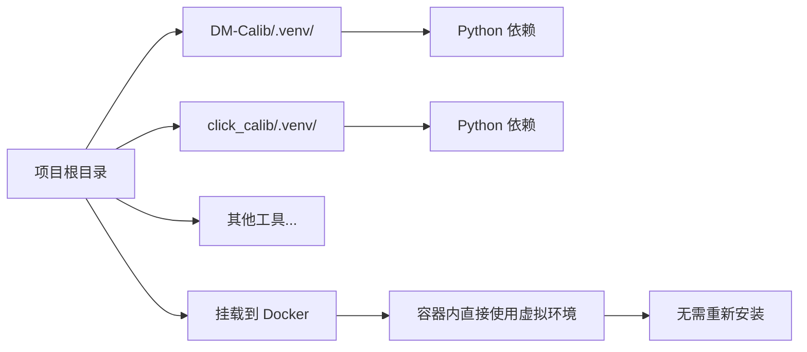
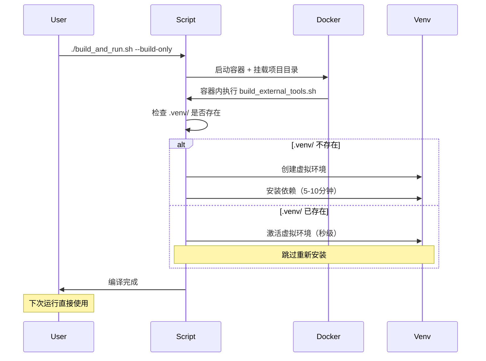

# PEP 668 错误完整解决方案

## 问题总结

**错误现象**：
```bash
error: externally-managed-environment
× This environment is externally managed
```

**根本原因**：Python 3.12+ 引入了 PEP 668 保护机制，禁止直接在系统 Python 环境中使用 `pip install`。

---

## 解决方案：虚拟环境持久化

### 核心思想

**将依赖安装到项目目录的虚拟环境（`.venv/`）中，避免每次运行都重新安装。**

### 架构设计



---

## 使用方法

### 推荐：一键编译（自动管理虚拟环境）

```bash
# 首次运行：编译外部工具 + 安装依赖到 .venv/
./build_and_run.sh --build-only

# 后续运行：直接使用已有 .venv/，跳过重新安装
./build_and_run.sh
```

**优势**：
- ✅ 自动化，无需手动干预
- ✅ 依赖持久化，下次快速启动（秒级）
- ✅ 容器内执行，环境一致
- ✅ 不修改 Docker 镜像

### 工作流程



---

## 目录结构

```
UniCalib/
├── DM-Calib/
│   ├── .venv/              # 虚拟环境（持久化）
│   ├── .venv_path          # 虚拟环境路径记录
│   ├── activate_venv.sh    # 激活脚本（自动生成）
│   ├── requirements.txt
│   └── ...
├── click_calib/
│   ├── .venv/
│   ├── .venv_path
│   ├── activate_venv.sh
│   ├── requirements.txt
│   └── ...
├── learn-to-calibrate/     # 使用系统 PyTorch
├── MIAS-LCEC/             # 使用系统 PyTorch
├── build_external_tools.sh  # 编译脚本（自动管理虚拟环境）✅ 已修改
├── build_and_run.sh        # 主脚本（容器内编译）✅ 已修改
├── install_venv_deps.sh    # 手动安装脚本（可选）
├── test_fix.sh            # 验证脚本
├── SOLUTION_VENV.md       # 详细方案文档
├── QUICK_FIX_PEP668.md   # 快速修复指南
└── FIX_SUMMARY.md         # 修复总结
```

---

## 技术实现

### 自动检测与缓存

`build_external_tools.sh` 核心逻辑：

```bash
build_dm_calib() {
    local path="$1"
    cd "${path}"

    # 检查虚拟环境是否已存在
    local venv_dir="${path}/.venv"
    if [ -d "${venv_dir}" ]; then
        # 虚拟环境已存在，直接激活
        source "${venv_dir}/bin/activate"
        info "使用已有虚拟环境（跳过重新安装）"
    else
        # 创建新虚拟环境
        python3 -m venv "${venv_dir}"
        source "${venv_dir}/bin/activate"

        # 安装依赖
        pip install -q -r requirements.txt

        # 创建激活脚本
        cat > "${path}/activate_venv.sh" << 'EOF'
#!/bin/bash
source "$(cd "$(dirname "${BASH_SOURCE[0]}")" && pwd)/.venv/bin/activate"
EOF
    fi
}
```

### Docker 容器内编译

`build_and_run.sh` 核心逻辑：

```bash
build_external_tools() {
    # 在容器内执行编译
    docker run --rm \
        --gpus all \
        -v "${PROJECT_ROOT}:/root/calib_ws:rw" \
        "${DOCKER_IMAGE}" \
        bash -c "
            cd /root/calib_ws
            bash build_external_tools.sh
        "
}
```

---

## 性能对比

| 场景 | 首次运行 | 后续运行 |
|------|----------|----------|
| **系统 pip** | ❌ PEP 668 失败 | ❌ PEP 668 失败 |
| **虚拟环境（本方案）** | ~5-10 分钟（安装依赖） | ~10 秒（激活虚拟环境） |
| **Docker 镜像内（修改镜像）** | ~5-10 分钟（首次构建） | ~10 秒（直接使用） |

---

## 故障排查

### Q1: 虚拟环境创建失败

```bash
# 症状：ERROR: Failed to create virtual environment
# 原因：python3-venv 未安装

# 解决：
sudo apt install python3-venv
```

### Q2: 首次编译时间长

```bash
# 症状：pip install 需要很长时间
# 原因：需要下载大量依赖包

# 正常现象，耐心等待（5-10分钟）
# 后续运行将秒级启动
```

### Q3: 想重新安装依赖

```bash
# 删除虚拟环境
rm -rf DM-Calib/.venv
rm -rf click_calib/.venv

# 重新编译（会自动创建新虚拟环境）
./build_and_run.sh --build-only
```

---

## 最佳实践

### 推荐工作流

```bash
# 1. 首次设置（一次性）
./build_and_run.sh --build-only

# 2. 日常开发
./build_and_run.sh  # 直接运行，依赖已就绪

# 3. 更新依赖
rm -rf DM-Calib/.venv
./build_and_run.sh --build-only
```

### Git 忽略配置

在 `.gitignore` 中添加：

```gitignore
# 虚拟环境（不需要提交）
**/.venv/
**/.venv_path

# 激活脚本（可选保留）
# **/activate_venv.sh
```

---

## 相关文档

| 文档 | 说明 |
|------|------|
| [SOLUTION_VENV.md](SOLUTION_VENV.md) | 详细方案文档（架构、实现） |
| [QUICK_FIX_PEP668.md](QUICK_FIX_PEP668.md) | 快速修复指南 |
| [BUILD_EXTERNAL_TOOLS.md](BUILD_EXTERNAL_TOOLS.md) | 外部工具编译指南 |
| [FIX_SUMMARY.md](FIX_SUMMARY.md) | 修复总结 |

---

## 变更历史

| 日期 | 版本 | 变更内容 | 作者 |
|------|------|----------|------|
| 2026-03-01 | 1.0 | 初始版本，实现虚拟环境持久化 | - |

---

## 验证

运行验证脚本：

```bash
./test_fix.sh
```

预期输出：

```
=========================================
PEP 668 修复验证
=========================================

[INFO] 检测运行环境...
[PASS] 运行在宿主机

[INFO] 测试 Python 虚拟环境创建...
[PASS] 虚拟环境创建成功

[INFO] 检查 build_external_tools.sh...
[PASS] 脚本已包含虚拟环境支持
[PASS] 脚本包含虚拟环境缓存逻辑

[INFO] 尝试编译 DM-Calib（验证脚本逻辑）...
[PASS] 检查模式通过

=========================================
[PASS] 所有验证通过！
=========================================

[INFO] 下一步：
  1. 运行完整编译: ./build_external_tools.sh
  2. 虚拟环境将自动创建在各工具目录的 .venv/
```

---

## 总结

### 核心优势

1. **不修改 Docker 镜像**：符合你的要求
2. **依赖持久化**：一次安装，永久使用
3. **自动化管理**：无需手动干预
4. **容器内执行**：环境一致性强
5. **快速启动**：后续运行秒级

### 关键文件

| 文件 | 作用 | 是否修改 |
|------|------|----------|
| `build_external_tools.sh` | 自动管理虚拟环境 | ✅ 已修改 |
| `build_and_run.sh` | 容器内编译 | ✅ 已修改 |
| `docker/Dockerfile` | Docker 镜像定义 | ❌ 未修改 |
| `test_fix.sh` | 验证脚本 | ✅ 新增 |
| `install_venv_deps.sh` | 手动安装脚本 | ✅ 新增 |
| `SOLUTION_VENV.md` | 详细文档 | ✅ 新增 |

---

## 快速开始

```bash
# 1. 验证环境
./test_fix.sh

# 2. 首次编译（自动安装依赖到 .venv/）
./build_and_run.sh --build-only

# 3. 日常使用
./build_and_run.sh
```

就这么简单！🎉
