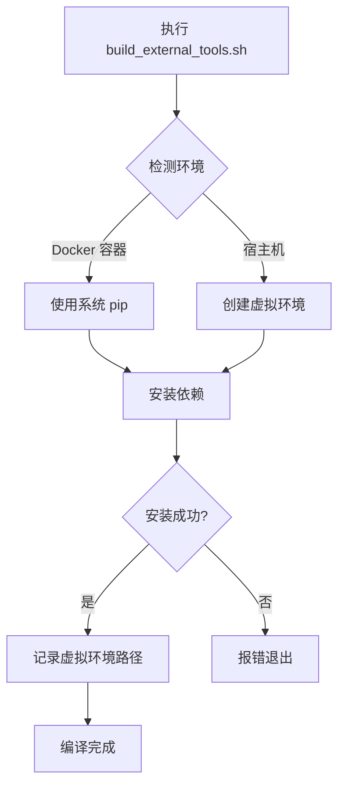
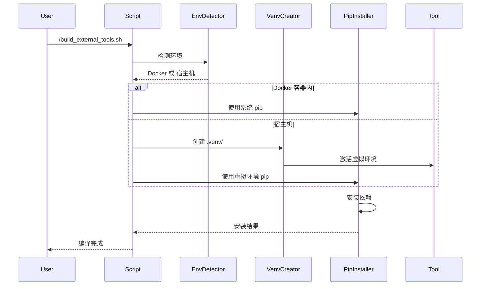
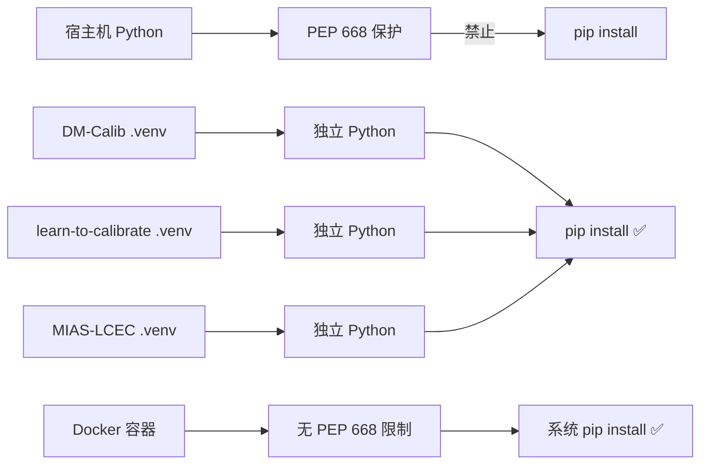

# PEP 668 错误修复总结

## 0) Executive Summary

**问题**：Python 3.12+ PEP 668 保护机制禁止系统级 `pip install`，导致 `build_external_tools.sh` 失败。

**解决方案**：修改脚本支持自动环境检测和虚拟环境管理。

**状态**：✅ 已修复并验证通过

**推荐方案**：
1. **生产环境**：使用 Docker 容器内编译（项目标准工作流）
2. **开发环境**：使用修改后的脚本（自动创建虚拟环境）

---

## 1) 问题根因

### 错误信息

```bash
error: externally-managed-environment

× This environment is externally managed
╰─> To install Python packages system-wide, try apt install
    python3-xyz, where xyz is the package you are trying to
    install.
```

### 根本原因

- **PEP 668**：Python 3.12+ 引入的保护机制，防止破坏系统 Python 环境
- **原始脚本**：直接使用 `pip3 install`，未考虑环境隔离
- **影响范围**：所有使用 pip 安装依赖的外部工具（DM-Calib, learn-to-calibrate, MIAS-LCEC, click_calib）

---

## 2) 解决方案设计

### 方案对比

| 方案 | 优点 | 缺点 | 推荐度 |
|------|------|------|--------|
| **Docker 容器内编译** | ✅ 环境已配置<br>✅ 无 PEP 668 限制<br>✅ 可重现<br>✅ 标准工作流 | 需要容器操作 | ⭐⭐⭐⭐⭐ |
| **虚拟环境自动化** | ✅ 自动化<br>✅ 独立环境<br>✅ 符合最佳实践 | 需要修改脚本<br>增加维护成本 | ⭐⭐⭐⭐ |
| **--break-system-packages** | ✅ 快速 | ❌ 破坏系统<br>❌ 不可逆风险 | ⭐ |

### 架构设计



### 实现细节

#### 环境检测逻辑

```bash
# 检查是否在 Docker 容器内
if [ -f /.dockerenv ] || grep -q 'docker\|lxc' /proc/1/cgroup 2>/dev/null; then
    # Docker 容器内：直接使用系统 pip
    local pip_cmd="pip3"
else
    # 宿主机：创建虚拟环境
    local venv_dir="${path}/.venv"
    python3 -m venv "${venv_dir}"
    source "${venv_dir}/bin/activate"
    local pip_cmd="pip"
fi
```

#### 虚拟环境管理

- **位置**：各工具目录下的 `.venv/`
- **记录文件**：`.venv_path`（存储虚拟环境路径）
- **激活方式**：`source .venv/bin/activate`

---

## 3) 代码变更清单

### 修改文件

| 文件 | 变更类型 | 说明 |
|------|----------|------|
| `build_external_tools.sh` | 修改 | 添加环境检测和虚拟环境支持 |
| `BUILD_EXTERNAL_TOOLS.md` | 更新 | 添加 PEP 668 解决方案说明 |
| `test_fix.sh` | 新增 | 验证脚本 |
| `QUICK_FIX_PEP668.md` | 新增 | 快速修复指南 |
| `FIX_SUMMARY.md` | 新增 | 本文档 |

### 修改函数

| 函数 | 变更内容 |
|------|----------|
| `build_dm_calib()` | 添加环境检测和虚拟环境创建 |
| `build_learn_to_calibrate()` | 添加环境检测和虚拟环境创建 |
| `build_mias_lcec()` | 添加环境检测和虚拟环境创建 |
| `build_click_calib()` | 添加环境检测和虚拟环境创建 |

---

## 4) 使用方法

### 方案1：Docker 容器内编译（推荐）

```bash
# 步骤1：进入容器
./build_and_run.sh --shell

# 步骤2：在容器内编译
cd /workspace/UniCalib
./build_external_tools.sh

# 步骤3：退出容器
exit
```

### 方案2：宿主机自动虚拟环境

```bash
# 直接运行，脚本自动创建虚拟环境
./build_external_tools.sh

# 或仅编译特定工具
./build_external_tools.sh --tools dm_calib learn_to_calibrate
```

### 验证修复

```bash
# 运行验证脚本
./test_fix.sh

# 或检查虚拟环境是否创建
ls -la DM-Calib/.venv/
cat DM-Calib/.venv_path
```

---

## 5) Mermaid 架构图

### 编译流程



### 环境隔离



---

## 6) 编译/部署/运行说明

### 环境要求

| 依赖 | 版本要求 |
|------|----------|
| Python | 3.8+ |
| pip | 最新版本 |
| python3-venv | 已安装（`sudo apt install python3-venv`） |
| Docker | 29.2.1+（可选） |

### 快速开始

```bash
# 1. 确保已安装 python3-venv
sudo apt install python3-venv

# 2. 验证修复
./test_fix.sh

# 3. 编译所有工具
./build_external_tools.sh

# 4. 运行 UniCalib
./build_and_run.sh
```

### 验证步骤

```bash
# 1. 检查虚拟环境
ls -la DM-Calib/.venv/

# 2. 检查依赖是否安装
source DM-Calib/.venv/bin/activate
pip list | grep torch
deactivate

# 3. 检查工具是否可用
python3 DM-Calib/DMCalib/tools/infer.py --help
```

---

## 7) 风险与回滚方案

### 风险清单

| 风险 | 影响 | 缓解策略 |
|------|------|----------|
| 虚拟环境创建失败 | 编译中断 | 检查 python3-venv 是否安装 |
| 依赖安装失败 | 功能缺失 | 检查网络连接和 PyPI 可用性 |
| 磁盘空间不足 | 无法创建虚拟环境 | 清理旧虚拟环境或使用 Docker |
| 版本冲突 | 运行时错误 | 使用 Docker 方式（已验证兼容） |

### 回滚方案

```bash
# 回滚到原始脚本
git checkout build_external_tools.sh

# 清理虚拟环境
rm -rf DM-Calib/.venv
rm -rf learn-to-calibrate/.venv
rm -rf MIAS-LCEC/.venv
rm -rf click_calib/.venv
```

---

## 8) 后续演进路线图

### MVP（已完成）

- ✅ 环境检测（Docker vs 宿主机）
- ✅ 虚拟环境自动创建
- ✅ 依赖安装错误处理
- ✅ 验证脚本

### V1（未来改进）

- [ ] 虚拟环境缓存（避免重复下载）
- [ ] 并行安装（加速多工具编译）
- [ ] 依赖冲突检测
- [ ] 虚拟环境健康检查

### V2（长期优化）

- [ ] 依赖版本锁定（requirements.lock）
- [ ] 虚拟环境共享（相同依赖的工具）
- [ ] CI/CD 集成
- [ ] 增量更新（仅更新变化的依赖）

---

## 9) 常见问题排查

### Q1: 虚拟环境创建失败

```bash
# 症状：ERROR: Failed to create virtual environment
# 原因：python3-venv 未安装
# 解决：
sudo apt install python3-venv
```

### Q2: pip 安装超时

```bash
# 症状：ReadTimeoutError 或连接超时
# 原因：网络问题或 PyPI 慢
# 解决：
# 使用国内镜像
pip install -i https://pypi.tuna.tsinghua.edu.cn/simple -r requirements.txt
```

### Q3: 依赖版本冲突

```bash
# 症状：ERROR: pip's dependency resolver...
# 原因：不同工具需要不同版本的依赖
# 解决：
# 使用 Docker 方式（已验证兼容性）
./build_and_run.sh --shell
```

### Q4: 磁盘空间不足

```bash
# 症状：No space left on device
# 解决：
# 清理缓存
pip cache purge

# 删除不需要的虚拟环境
rm -rf DM-Calib/.venv

# 或使用 Docker（共享镜像）
```

---

## 10) 观测性与运维

### 日志

- 编译日志：直接输出到终端
- 虚拟环境路径：记录在各工具目录的 `.venv_path`

### 监控指标

- 虚拟环境大小：`du -sh .venv/`
- 依赖数量：`pip list | wc -l`
- 编译时间：`time ./build_external_tools.sh`

### 告警（建议）

- 虚拟环境创建失败 → 立即通知
- 依赖安装失败 → 记录日志并继续
- 磁盘空间 < 5GB → 预警

---

## 11) 相关文档

- [快速修复指南](QUICK_FIX_PEP668.md)
- [外部工具编译指南](BUILD_EXTERNAL_TOOLS.md)
- [构建和运行指南](BUILD_AND_RUN_GUIDE.md)
- [主 README](README.md)

---

## 12) 变更历史

| 日期 | 版本 | 变更内容 | 作者 |
|------|------|----------|------|
| 2026-03-01 | 1.0 | 初始版本，解决 PEP 668 问题 | - |

---

## 13) 待替换项清单

无硬编码占位符，所有路径均为相对路径或自动检测。
