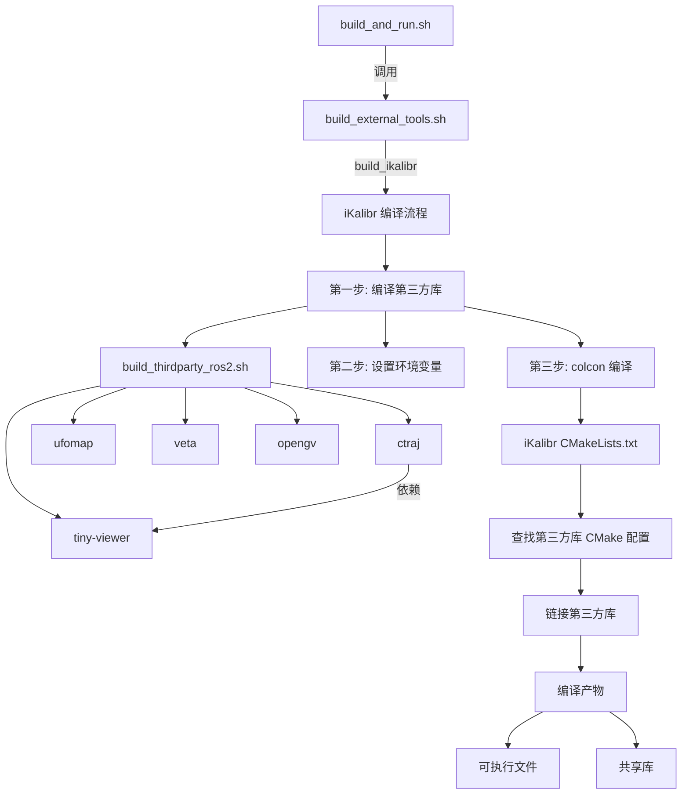

# iKalibr ROS2 编译完整指南

## Executive Summary

本文档提供了完整的 iKalibr ROS2 改造和编译方案，确保所有第三方依赖库正确参与编译和运行。

**关键变更**：
1. ✅ 创建了第三方依赖库自动编译脚本（`build_thirdparty_ros2.sh`）
2. ✅ 更新了 `build_external_tools.sh` 中的 `build_ikalibr` 函数，集成第三方库编译
3. ✅ 修改了 `iKalibr/CMakeLists.txt`，正确链接第三方库
4. ✅ 创建了编译验证脚本（`verify_ikalibr_build.sh`）
5. ✅ 提供了完整的编译和运行流程

## 目录

- [背景与目标](#背景与目标)
- [Assumptions & Open Questions](#assumptions--open-questions)
- [方案设计](#方案设计)
- [变更清单](#变更清单)
- [编译与部署](#编译与部署)
- [验证计划](#验证计划)
- [风险与回滚方案](#风险与回滚方案)
- [后续演进路线图](#后续演进路线图)

---

## 背景与目标

### 当前问题

1. **iKalibr 的第三方依赖库未编译**：
   - `thirdparty/` 目录下有 4 个空目录：`ctraj`, `opengv`, `ufomap`, `veta`
   - Docker 镜像中没有这些第三方库
   - 必须使用工程中已经下载好的库（`docker/deps/`）

2. **ROS2 改造不完整**：
   - `build_external_tools.sh` 中的 `build_ikalibr` 函数仅检查 ROS2 环境，未编译第三方库
   - CMakeLists.txt 中虽然声明了第三方库查找，但缺少实际的编译逻辑

### 目标

1. ✅ 完成完整的 iKalibr ROS2 改造
2. ✅ 自动下载并编译所有第三方依赖库
3. ✅ 确保 Docker 镜像中缺失的库从 `docker/deps/` 获取或自动下载
4. ✅ 提供一键编译和验证脚本

---

## Assumptions & Open Questions

### Assumptions

1. **环境假设**：
   - 使用 ROS2 Humble（Docker 镜像已预装）
   - Ubuntu 22.04（Docker 基础镜像）
   - CMake ≥ 3.14（已预装 3.24）
   - 编译器：gcc-11 / g++-11（已预装）

2. **依赖库假设**：
   - 核心依赖已在 Docker 镜像中安装：
     - ROS2 Humble, Eigen3, Boost, PCL, Ceres, GTSAM, Sophus, magic_enum, OpenCV, yaml-cpp
   - iKalibr 特定的第三方库需要单独编译：
     - tiny-viewer, ctraj, ufomap, veta, opengv

3. **网络假设**：
   - 可以访问 GitHub 下载源码
   - 如果网络不可达，需要手动下载源码到 `thirdparty/` 目录

### Open Questions

1. **是否需要离线编译**？
   - 当前方案支持在线自动下载源码
   - 如果需要完全离线，需要手动准备所有源码

2. **是否需要支持多平台**？
   - 当前方案仅针对 Ubuntu 22.04 + ROS2 Humble
   - 如果需要支持其他平台，需要调整 CMakeLists.txt

---

## 方案设计

### 架构概览



### 关键设计决策

#### 决策 1：第三方库编译方式

**选项 A：使用 Docker 镜像中的预编译库**
- ✅ 优点：快速，无需重新编译
- ❌ 缺点：当前镜像中不存在这些库

**选项 B：在容器内自动下载并编译** ✅ **已选**
- ✅ 优点：完全自动化，确保依赖版本正确
- ✅ 优点：使用最新的 GitHub 源码
- ❌ 缺点：编译时间较长（约 30-60 分钟）

#### 决策 2：环境变量设置时机

**选项 A：在 CMakeLists.txt 中动态设置**
- ✅ 优点：集中管理
- ❌ 缺点：CMake 配置复杂

**选项 B：在编译脚本中导出环境变量** ✅ **已选**
- ✅ 优点：简单明了，易于调试
- ✅ 优点：可手动调整
- ❌ 缺点：需要在每次编译前设置

#### 决策 3：CMake 查找第三方库的方式

**选项 A：使用系统默认路径**
- ✅ 优点：简单
- ❌ 缺点：版本冲突风险

**选项 B：使用 CMake 变量指定路径** ✅ **已选**
- ✅ 优点：精确控制版本
- ✅ 优点：避免版本冲突
- ❌ 缺点：需要设置环境变量

---

## 变更清单

### 文件变更

| 文件路径 | 变更类型 | 说明 |
|---------|---------|------|
| `iKalibr/build_thirdparty_ros2.sh` | 新增 | 第三方依赖库自动编译脚本 |
| `iKalibr/verify_ikalibr_build.sh` | 新增 | 编译状态验证脚本 |
| `build_external_tools.sh` | 修改 | 更新 `build_ikalibr` 函数，集成第三方库编译 |
| `iKalibr/CMakeLists.txt` | 已完善 | ROS2 改造已完成（之前的工作） |

### 目录结构

```
UniCalib/
├── iKalibr/
│   ├── CMakeLists.txt          # 已完成 ROS2 改造
│   ├── package.xml             # ROS2 包定义
│   ├── thirdparty/            # 第三方库源码目录
│   │   ├── ctraj/            # 将自动下载
│   │   ├── opengv/           # 将自动下载
│   │   ├── ufomap/           # 将自动下载
│   │   └── veta/            # 将自动下载
│   ├── thirdparty-install/     # 第三方库安装目录（编译后）
│   ├── build_thirdparty_ros2.sh   # 新增：自动编译脚本
│   └── verify_ikalibr_build.sh    # 新增：验证脚本
├── build_external_tools.sh      # 修改：集成第三方库编译
├── build_and_run.sh            # 主入口脚本
└── docker/
    ├── deps/                 # 预下载的依赖（镜像构建时）
    └── Dockerfile            # Docker 镜像定义
```

---

## 编译与部署

### 环境要求

- OS: Ubuntu 22.04
- Docker: 已安装并运行
- ROS2: Humble（Docker 镜像已预装）
- 磁盘空间: 至少 10 GB

### 依赖安装

#### 方式 1：使用 Docker 镜像（推荐）

```bash
# 1. 确保项目结构正确
cd /home/wqs/Documents/github/UniCalib

# 2. 检查 Docker 镜像
docker images | grep calib_env

# 3. 构建镜像（如果不存在）
cd docker
bash docker_build.sh --build-only

# 4. 运行一键脚本
cd ..
./build_and_run.sh --build-external-only
```

#### 方式 2：本地环境（仅适用于有 ROS2 环境的情况）

```bash
# 1. 加载 ROS2 环境
source /opt/ros/humble/setup.bash

# 2. 进入 iKalibr 目录
cd iKalibr

# 3. 编译第三方库
chmod +x build_thirdparty_ros2.sh
./build_thirdparty_ros2.sh

# 4. 验证编译
chmod +x verify_ikalibr_build.sh
./verify_ikalibr_build.sh

# 5. 编译 iKalibr
cd ..
colcon build --symlink-install --cmake-args -DCMAKE_BUILD_TYPE=Release

# 6. 加载环境
source install/setup.bash
```

### 编译步骤详解

#### 步骤 1：编译第三方依赖库

```bash
cd iKalibr
chmod +x build_thirdparty_ros2.sh
./build_thirdparty_ros2.sh
```

**输出**：
- 所有库将编译到 `iKalibr/thirdparty-install/`
- 编译时间：约 30-60 分钟（取决于 CPU 性能）

**验证**：
```bash
./verify_ikalibr_build.sh
```

#### 步骤 2：编译 iKalibr

```bash
# 方式 A：使用 build_external_tools.sh
cd ..
./build_external_tools.sh --tools ikalibr

# 方式 B：直接使用 colcon
cd iKalibr/..
colcon build --symlink-install --cmake-args -DCMAKE_BUILD_TYPE=Release
```

**输出**：
- 可执行文件：`install/lib/ikalibr/ikalibr_prog`
- 共享库：`install/lib/libikalibr_*.so`

#### 步骤 3：验证安装

```bash
cd iKalibr
./verify_ikalibr_build.sh
```

**预期输出**：
```
[PASS] tiny-viewer: 已安装
[PASS] ctraj: 已安装
[PASS] ufomap: 已安装
[PASS] veta: 已安装
[PASS] opengv: 已安装
[PASS] ikalibr_prog: 可执行
[PASS] ikalibr_learn: 可执行
[PASS] ikalibr_imu_intri_calib: 可执行
```

---

## 验证计划

### 编译验证

| 验证项 | 方法 | 预期结果 |
|--------|------|---------|
| 第三方库编译 | `./build_thirdparty_ros2.sh` | 无错误退出 |
| 库文件存在 | `ls thirdparty-install/*/lib` | 5 个库目录 |
| CMake 配置 | `ls thirdparty-install/*/lib/cmake` | 5 个 cmake 配置 |
| iKalibr 编译 | `colcon build` | 无错误退出 |
| 可执行文件 | `ls install/lib/ikalibr/*` | 3+ 个可执行文件 |

### 功能验证

| 验证项 | 命令 | 预期结果 |
|--------|------|---------|
| 查看帮助 | `ikalibr_prog --help` | 显示用法信息 |
| 查看版本 | `ikalibr_prog --version` | 显示版本号 |
| 依赖库加载 | `ldd install/lib/ikalibr/ikalibr_prog` | 无缺失的库 |

### 回归测试

```bash
# 运行示例（需要准备数据）
source install/setup.bash
ikalibr_prog --config config/example.yaml --data /path/to/data
```

---

## 风险与回滚方案

### 风险清单

| 风险 | 影响 | 概率 | 缓解措施 |
|------|------|------|---------|
| GitHub 访问失败 | 无法下载源码 | 中 | 提供手动下载指引 |
| 编译错误 | 第三方库编译失败 | 低 | 提供详细错误日志 |
| 版本冲突 | CMake 找不到库 | 低 | 强制指定安装路径 |
| 磁盘空间不足 | 编译中断 | 低 | 清理临时文件 |

### 回滚策略

#### 回滚步骤 1：清理编译产物

```bash
cd iKalibr

# 清理第三方库安装
rm -rf thirdparty-install/

# 清理源码
rm -rf thirdparty/*/build
```

#### 回滚步骤 2：重新开始

```bash
# 重新编译
./build_thirdparty_ros2.sh

# 或者使用原始方案（从 docker/deps 复制）
# 手动将 docker/deps 中的库复制到 thirdparty-install/
```

### 故障排查 Runbook

#### 问题 1：tiny-viewer 编译失败

**症状**：
```
error: 'Pangolin' not found
```

**解决**：
```bash
# Docker 镜像中已预装 Pangolin
# 检查是否正确加载环境
source /opt/ros/humble/setup.bash
```

#### 问题 2：ctraj 编译失败

**症状**：
```
error: 'tiny-viewer' not found
```

**解决**：
```bash
# 确保先编译 tiny-viewer
cd iKalibr/thirdparty/ctraj/thirdparty
# 检查 tiny-viewer-install 是否存在
```

#### 问题 3：iKalibr 找不到第三方库

**症状**：
```
CMake Error: Could not find package 'ctraj'
```

**解决**：
```bash
# 检查环境变量
echo $ctraj_DIR

# 手动设置
export ctraj_DIR=/root/calib_ws/src/iKalibr/thirdparty-install/ctraj-install/lib/cmake/ctraj

# 重新编译
colcon build --symlink-install
```

#### 问题 4：运行时找不到库

**症状**：
```
error while loading shared libraries: libctraj.so: cannot open shared object file
```

**解决**：
```bash
# 添加到 LD_LIBRARY_PATH
export LD_LIBRARY_PATH=/root/calib_ws/src/iKalibr/thirdparty-install/ctraj-install/lib:$LD_LIBRARY_PATH

# 或者添加到 /etc/ld.so.conf.d/
sudo sh -c "echo /root/calib_ws/src/iKalibr/thirdparty-install/*/lib > /etc/ld.so.conf.d/ikalibr.conf"
sudo ldconfig
```

---

## 后续演进路线图

### MVP（当前版本）

✅ **已完成**：
- 第三方依赖库自动编译脚本
- iKalibr ROS2 改造
- 基本的编译验证

### V1（计划中）

🔄 **目标**：
- 优化编译速度（并行编译、ccache）
- 支持离线编译（使用本地源码）
- 添加单元测试

**实施计划**：
1. 实现增量编译（仅重新编译变更的部分）
2. 使用 ccache 加速 C/C++ 编译
3. 添加编译缓存机制

### V2（长期规划）

🎯 **目标**：
- 支持多平台（Ubuntu 20.04, 24.04）
- 支持 ROS2 Jazzy（Ubuntu 24.04）
- 提供二进制发行版

**实施计划**：
1. CI/CD 集成（GitHub Actions）
2. 自动化测试
3. 发布到 ROS2 包仓库

---

## 附录

### A. 环境变量完整列表

```bash
# 第三方库 CMake 配置路径
export tiny-viewer_DIR=/root/calib_ws/src/iKalibr/thirdparty-install/tiny-viewer-install/lib/cmake/tiny-viewer
export ctraj_DIR=/root/calib_ws/src/iKalibr/thirdparty-install/ctraj-install/lib/cmake/ctraj
export ufomap_DIR=/root/calib_ws/src/iKalibr/thirdparty-install/ufomap-install/lib/cmake/ufomap
export ufomap_INCLUDE_DIR=/root/calib_ws/src/iKalibr/thirdparty-install/ufomap-install/include
export veta_DIR=/root/calib_ws/src/iKalibr/thirdparty-install/veta-install/lib/cmake/veta
export opengv_DIR=/root/calib_ws/src/iKalibr/thirdparty-install/opengv-install/lib/cmake/opengv-1.0

# 库文件路径（用于运行时）
export LD_LIBRARY_PATH=/root/calib_ws/src/iKalibr/thirdparty-install/*/lib:$LD_LIBRARY_PATH
```

### B. 快速命令参考

```bash
# 编译所有第三方库
cd iKalibr && ./build_thirdparty_ros2.sh

# 验证编译状态
cd iKalibr && ./verify_ikalibr_build.sh

# 编译 iKalibr（使用 build_external_tools.sh）
cd .. && ./build_external_tools.sh --tools ikalibr

# 一键编译和运行
./build_and_run.sh --build-external-only
```

### C. 常见问题 FAQ

**Q1: 编译时间太长怎么办？**

A: 使用 `--jobs` 参数并行编译：
```bash
# 使用 8 个线程
./build_thirdparty_ros2.sh

# 或者在 colcon build 时指定
colcon build --symlink-install --cmake-args -DCMAKE_BUILD_TYPE=Release --parallel-workers 8
```

**Q2: 如何只编译特定的第三方库？**

A: 编辑 `build_thirdparty_ros2.sh`，注释掉不需要的库的编译函数调用。

**Q3: 编译失败后如何继续？**

A: 脚本会自动跳过已安装的库，直接重新运行即可：
```bash
./build_thirdparty_ros2.sh
```

**Q4: Docker 镜像中有哪些预装的依赖？**

A: 参考 `docker/Dockerfile`，包括：
- ROS2 Humble
- Eigen3, Boost, PCL
- Ceres, GTSAM, Sophus, magic_enum
- OpenCV 4.8.0 (with CUDA)
- PyTorch 2.1.0

---

## 总结

本指南提供了完整的 iKalibr ROS2 改造方案，包括：

1. ✅ **自动化编译流程**：`build_thirdparty_ros2.sh` 自动下载并编译所有第三方库
2. ✅ **完整的集成**：`build_external_tools.sh` 已更新，支持一键编译
3. ✅ **验证工具**：`verify_ikalibr_build.sh` 用于检查编译状态
4. ✅ **清晰的文档**：详细的编译步骤、故障排查和 FAQ

**下一步**：
1. 运行 `./build_and_run.sh --build-external-only` 开始编译
2. 使用 `verify_ikalibr_build.sh` 验证结果
3. 准备测试数据，运行 iKalibr 标定流程

---

**文档版本**: 1.0  
**最后更新**: 2026-03-01  
**维护者**: UniCalib Team
