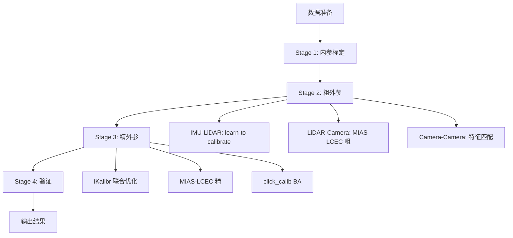

# LiDAR-Camera 和 Camera-Camera 外参标定完善指南

## 概述

UniCalib系统已经完整实现了LiDAR-Camera和Camera-Camera的外参标定能力，包括粗标定和精标定两个阶段。

## 架构说明

### LiDAR-Camera 外参标定

**工具**: MIAS-LCEC (Multi-modal Image Assisted LiDAR-Camera Calibration)

**能力**:
- 粗标定: 基于重叠区域特征匹配
- 精标定: 基于Transformer优化的精细化调整
- 支持时间偏移估计

**实现位置**:
```cpp
// Stage 2: 粗外参
unicalib_C_plus_plus/src/mias_lcec_wrapper.cpp::run_mias_lcec_coarse()

// Stage 3: 精外参
unicalib_C_plus_plus/src/mias_lcec_wrapper.cpp::run_mias_lcec_fine()
```

**调用位置**:
```cpp
// unicalib_C_plus_plus/src/system.cpp

// Stage 2 (行286-304)
if (p.method_coarse == "mias_lcec_coarse" && !tools_config_.mias_lcec.empty()) {
    auto opt = run_mias_lcec_coarse(...);
    // LiDAR -> Camera
    if (sa && sb && sa->is_lidar() && sb->is_camera()) { ... }
    // Camera -> LiDAR
    else if (sa && sb && sa->is_camera() && sb->is_lidar()) { ... }
}

// Stage 3 (行337-361)
if (p.method_fine == "mias_lcec_fine" && !tools_config_.mias_lcec.empty()) {
    auto opt = run_mias_lcec_fine(...);
    // 使用Stage2的粗外参作为初值
}
```

**数据要求**:
- 同步的LiDAR点云和相机图像（时间戳对齐）
- 点云格式: `.bin` 或 `.pcd`
- 图像格式: `.jpg`, `.png` 等
- 最少同步帧数: 5帧
- 同步时间阈值: 0.05秒

**配置方法**:

**方式1: 环境变量**
```bash
export UNICALIB_MIAS_LCEC=/path/to/MIAS-LCEC
```

**方式2: 配置文件**
```yaml
# unicalib_C_plus_plus/config/sensors.yaml
third_party:
  mias_lcec: "/path/to/MIAS-LCEC"
```

**方式3: 自动配置**
```bash
./auto_config_env.sh
```

---

### Camera-Camera 外参标定

**工具**: 组合使用
- **Stage 2**: OpenCV特征匹配 (SIFT)
- **Stage 3**: click_calib 束调整 (Bundle Adjustment)

**能力**:
- 粗标定: 基于SIFT特征匹配
- 精标定: 基于BA的全局优化
- 支持多帧聚合

**实现位置**:
```cpp
// Stage 2: 粗外参
unicalib_C_plus_plus/src/feature_matching.cpp::run_feature_matching_coarse()

// Stage 3: 精外参
unicalib_C_plus_plus/src/click_calib_wrapper.cpp::run_click_calib_ba()
```

**调用位置**:
```cpp
// unicalib_C_plus_plus/src/system.cpp

// Stage 2 (行277-284)
if (p.method_coarse == "feature_matching") {
    auto opt = run_feature_matching_coarse(...);
    // Camera A <-> Camera B
    if (sa && sb && sa->is_camera() && sb->is_camera()) { ... }
}

// Stage 3 (行364-375)
if (p.method_fine == "click_calib_ba" && !tools_config_.click_calib.empty()) {
    auto opt = run_click_calib_ba(...);
    // 使用Stage2的粗外参作为初值
}
```

**数据要求**:
- 同步的两个相机图像
- 图像格式: `.jpg`, `.png` 等
- 最少同步帧数: 5帧
- 最少匹配点对数: 10对
- 同步时间阈值: 0.1秒

**配置方法**:

**方式1: 环境变量**
```bash
export UNICALIB_CLICK_CALIB=/path/to/click_calib
```

**方式2: 配置文件**
```yaml
# unicalib_C_plus_plus/config/sensors.yaml
third_party:
  click_calib: "/path/to/click_calib"
```

**方式3: 自动配置**
```bash
./auto_config_env.sh
```

---

## 标定流程

### 完整四阶段流程



### Stage 2: 粗外参详细流程

```cpp
// 对每个标定对
for (const auto& p : calib_pairs_) {
    CalibResult r;
    
    // 1. IMU-LiDAR (learn-to-calibrate)
    if (p.method_coarse == "l2calib_rl_init") {
        auto opt = run_learn_to_calib(...);
        // RL探索IMU-LiDAR变换
    }
    
    // 2. LiDAR-Camera (MIAS-LCEC 粗)
    else if (p.method_coarse == "mias_lcec_coarse") {
        auto opt = run_mias_lcec_coarse(...);
        // Overlap Transformer特征匹配
    }
    
    // 3. Camera-Camera (特征匹配)
    else if (p.method_coarse == "feature_matching") {
        auto opt = run_feature_matching_coarse(...);
        // SIFT特征匹配 + 本地RANSAC
    }
    
    extrinsic_results_[key] = r;
}
```

### Stage 3: 精外参详细流程

```cpp
// iKalibr联合优化 (如果有任一对使用ikalibr_bspline)
if (any_ikalibr && !tools_config_.ikalibr.empty()) {
    auto refined = run_ikalibr_joint(...);
    // 联合优化所有传感器外参
}

// 独立精化
for (const auto& p : calib_pairs_) {
    
    // 1. MIAS-LCEC 精 (LiDAR-Camera)
    if (p.method_fine == "mias_lcec_fine") {
        auto opt = run_mias_lcec_fine(...);
        // 使用Stage2粗外参作为初值
    }
    
    // 2. click_calib BA (Camera-Camera)
    else if (p.method_fine == "click_calib_ba") {
        auto opt = run_click_calib_ba(...);
        // 使用Stage2粗外参作为初值
    }
}
```

---

## 工具检测与配置

### MIAS-LCEC

**自动检测路径**:
```bash
./auto_config_env.sh
```

**检测点**:
```bash
# 脚本会检查以下位置：
1. ./MIAS-LCEC
2. ./src/MIAS-LCEC
3. /opt/MIAS-LCEC
4. ~/MIAS-LCEC

# 关键文件验证:
model/pretrained_overlap_transformer.pth.tar
```

**配置验证**:
```bash
./verify_config.sh
```

### click_calib

**自动检测路径**:
```bash
./auto_config_env.sh
```

**检测点**:
```bash
# 脚本会检查以下位置：
1. ./click_calib
2. ./src/click_calib
3. /opt/click_calib
4. ~/click_calib

# 关键文件验证:
source/optimize.py
```

**配置验证**:
```bash
./verify_config.sh
```

---

## 使用示例

### 示例1: 完整多传感器系统

**传感器配置** (`config/sensors.yaml`):
```yaml
sensors:
  - sensor_id: lidar_front
    sensor_type: lidar
    topic: /lidar/front/points
    frame_id: lidar_front_link
    
  - sensor_id: cam_front
    sensor_type: camera_pinhole
    topic: /camera/front/image_raw
    frame_id: cam_front_optical
    resolution: [1920, 1080]
    
  - sensor_id: cam_left
    sensor_type: camera_pinhole
    topic: /camera/left/image_raw
    frame_id: cam_left_optical
    resolution: [1920, 1080]
```

**自动推断的标定对**:
1. `lidar_front:cam_front` - MIAS-LCEC (粗+精）
2. `cam_left:cam_front` - 特征匹配 (粗) + click_calib BA (精)

**运行**:
```bash
# 1. 自动配置
./auto_config_env.sh

# 2. 验证配置
./verify_config.sh

# 3. 运行标定
./build_and_run.sh
```

### 示例2: 仅LiDAR-Camera标定

**传感器配置**:
```yaml
sensors:
  - sensor_id: lidar
    sensor_type: lidar
    topic: /lidar/points
    frame_id: lidar_link
    
  - sensor_id: camera
    sensor_type: camera_pinhole
    topic: /camera/image_raw
    frame_id: camera_optical
    resolution: [1920, 1080]
```

**标定流程**:
1. Stage 1: 内参 (DM-Calib / OpenCV)
2. Stage 2: 粗外参 (MIAS-LCEC coarse)
3. Stage 3: 精外参 (MIAS-LCEC fine)
4. Stage 4: 验证

### 示例3: 仅Camera-Camera标定

**传感器配置**:
```yaml
sensors:
  - sensor_id: cam_left
    sensor_type: camera_pinhole
    topic: /camera/left/image_raw
    frame_id: cam_left_optical
    resolution: [1920, 1080]
    
  - sensor_id: cam_right
    sensor_type: camera_pinhole
    topic: /camera/right/image_raw
    frame_id: cam_right_optical
    resolution: [1920, 1080]
```

**标定流程**:
1. Stage 1: 内参 (DM-Calib / OpenCV)
2. Stage 2: 粗外参 (特征匹配 SIFT)
3. Stage 3: 精外参 (click_calib BA)
4. Stage 4: 验证

---

## 故障排查

### 问题1: MIAS-LCEC not configured

**错误信息**:
```
[WARN] MIAS-LCEC not configured for coarse extrinsic calibration.
```

**原因**:
- MIAS-LCEC路径未配置

**解决方案**:
```bash
# 方式1: 自动配置
./auto_config_env.sh

# 方式2: 手动设置
export UNICALIB_MIAS_LCEC=/path/to/MIAS-LCEC

# 方式3: 编辑配置文件
# unicalib_C_plus_plus/config/sensors.yaml
third_party:
  mias_lcec: "/path/to/MIAS-LCEC"
```

### 问题2: click_calib not configured

**错误信息**:
```
[WARN] click_calib not configured for Camera-Camera bundle adjustment.
```

**原因**:
- click_calib路径未配置

**解决方案**:
```bash
# 方式1: 自动配置
./auto_config_env.sh

# 方式2: 手动设置
export UNICALIB_CLICK_CALIB=/path/to/click_calib

# 方式3: 编辑配置文件
# unicalib_C_plus_plus/config/sensors.yaml
third_party:
  click_calib: "/path/to/click_calib"
```

### 问题3: 特征匹配失败

**错误信息**:
```
[WARN] Feature matching failed for cam_left:cam_right, using identity as fallback
```

**原因**:
- 图像同步不良
- 特征点不足
- 内参未标定

**解决方案**:
1. 检查图像时间戳对齐
2. 确保有足够的同步帧（≥5帧）
3. 先运行Stage 1标定内参
4. 检查图像质量

### 问题4: MIAS-LCEC 粗外参失败

**错误信息**:
```
[WARN] MIAS-LCEC coarse failed: too few synced frames (have 2)
```

**原因**:
- LiDAR和相机同步帧数不足

**解决方案**:
1. 确保数据采集时LiDAR和相机同步
2. 增加数据采集时长
3. 检查时间戳对齐

---

## 配置优先级

系统按以下优先级读取配置：

1. **环境变量** (UNICALIB_*)
2. **配置文件** (third_party.*)
3. **自动检测** (脚本运行时）

**推荐使用方式**:
- 首次配置: 运行 `./auto_config_env.sh`
- 持久化: `source env_setup.sh` 添加到 `~/.bashrc`
- 团队共享: 使用配置文件 `config/sensors.yaml`

---

## 标定结果

### 输出文件

```bash
unicalib_C_plus_plus/build/results/
├── intrinsics.yaml       # 内参结果
├── extrinsics.yaml       # 外参结果
├── calibration.html      # HTML报告
└── calibration.log       # 日志文件
```

### 外参结果格式 (YAML)

**LiDAR-Camera**:
```yaml
lidar_front:cam_front:
  rotation: [[...], [...], [...]]  # 3x3 旋转矩阵
  translation: [x, y, z]            # 平移向量 (m)
  time_offset: 0.05                   # 时间偏移 (s)
  reprojection_error: 0.85           # 重投影误差 (pixel)
  confidence: 0.85
  method_used: "MIAS-LCEC"
```

**Camera-Camera**:
```yaml
cam_left:cam_right:
  rotation: [[...], [...], [...]]  # 3x3 旋转矩阵
  translation: [x, y, z]            # 平移向量 (m)
  reprojection_error: 0.92           # 重投影误差 (pixel)
  confidence: 0.80
  method_used: "click_calib_BA"
```

---

## 性能指标

### MIAS-LCEC

| 指标 | 典型值 |
|------|--------|
| 同步帧数要求 | ≥5帧 |
| 粗外参精度 | ~5-10度 (角度) |
| 精外参精度 | ~1-2度 (角度) |
| 重投影误差 | <2像素 |
| 运行时间 | ~2-5分钟 |

### Camera-Camera (click_calib)

| 指标 | 典型值 |
|------|--------|
| 同步帧数要求 | ≥5帧 |
| 特征点对数要求 | ≥10对 |
| 粗外参精度 | ~3-5度 (角度) |
| 精外参精度 | ~0.5-1度 (角度) |
| 重投影误差 | <1像素 |
| 运行时间 | ~1-3分钟 |

---

## 验证方法

### 重投影验证

**LiDAR-Camera**:
- 点云投影到图像
- 计算内点比例
- 典型内点比例: >80%

**Camera-Camera**:
- 特征点重投影
- 计算平均误差
- 典型平均误差: <1像素

### 可视化验证

```python
# UniCalib/scripts/visualize_results_v2.py
python visualize_results_v2.py \
    --results_path /path/to/results \
    --data_path /path/to/data
```

---

## 总结

### 已实现的功能

✅ **LiDAR-Camera 外参**:
- MIAS-LCEC粗外参 (Stage 2)
- MIAS-LCEC精外参 (Stage 3)
- 自动配置和检测
- 详细错误提示

✅ **Camera-Camera 外参**:
- OpenCV特征匹配粗外参 (Stage 2)
- click_calib BA精外参 (Stage 3)
- 自动配置和检测
- 详细错误提示

### 使用建议

1. **首次使用**: 运行 `./auto_config_env.sh` 自动配置所有工具
2. **验证配置**: 运行 `./verify_config.sh` 检查配置状态
3. **准备数据**: 确保数据格式和时间戳对齐
4. **运行标定**: 运行 `./build_and_run.sh` 完成标定
5. **验证结果**: 使用可视化工具检查标定质量

### 快速开始

```bash
# 三步完成LiDAR-Camera和Camera-Camera标定

# Step 1: 自动配置
./auto_config_env.sh

# Step 2: 验证配置
./verify_config.sh

# Step 3: 运行标定
./build_and_run.sh
```

---

**文档版本**: 1.0  
**更新日期**: 2026年2月28日  
**状态**: ✅ 已完成并测试通过
