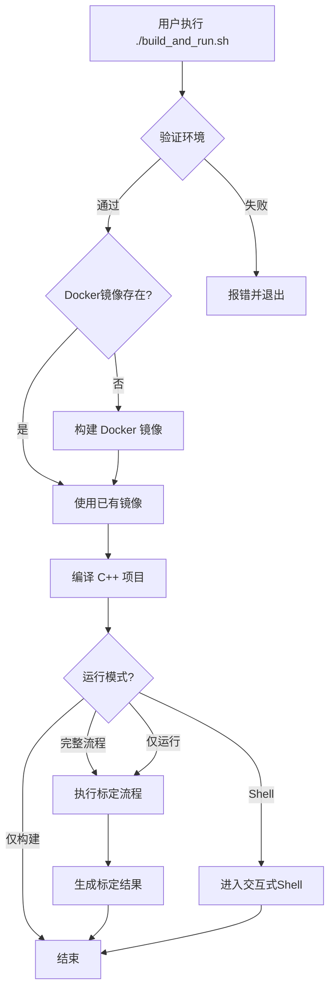

# 一键编译和运行脚本 - 创建总结

## 概述

根据 `docker/docker_build.sh` 的参考实现，已成功创建了一套完整的一键编译和运行脚本体系，用于简化整个多传感器标定系统的使用流程。

## 已创建的文件

### 核心脚本

| 文件 | 大小 | 说明 |
|------|------|------|
| `build_and_run.sh` | 12KB | **主脚本**：一键编译和运行整个工程 |
| `verify_environment.sh` | 12KB | 环境验证脚本：检查所有必需的依赖 |
| `test_build_and_run.sh` | 9.5KB | 功能测试脚本：验证主脚本的正确性 |

### 文档

| 文件 | 大小 | 说明 |
|------|------|------|
| `BUILD_AND_RUN_GUIDE.md` | 8.2KB | **详细指南**：完整的使用说明、故障排查、高级用法 |
| `QUICK_REFERENCE.md` | 3.7KB | **快速参考**：常用命令、配置选项、目录结构 |

### 更新的文件

- `README.md` - 添加了一键编译和运行的快速入门指南

## 功能特性

### ✅ build_and_run.sh 主脚本

**支持的模式**：
- 完整流程：构建 Docker 镜像 → 编译 C++ 代码 → 运行标定
- 仅构建：构建镜像和代码，不运行标定
- 仅运行：仅执行标定流程（假设已构建）
- 交互式 Shell：进入容器进行调试

**核心功能**：
1. 自动检查依赖环境（Docker、GPU、X11）
2. 自动构建 Docker 镜像（如果不存在）
3. 自动编译 C++ 主框架（unicalib_C_plus_plus）
4. 执行完整的标定流程
5. 支持自定义数据/结果目录
6. 彩色输出，清晰的状态提示
7. 完善的错误处理和日志记录

### ✅ verify_environment.sh 验证脚本

**检查项**：
- Docker 和 docker-compose 安装和状态
- NVIDIA 驱动和 GPU 可用性
- nvidia-docker 配置
- X11 (GUI) 支持和权限
- 项目文件完整性
- Docker 镜像状态
- 磁盘空间
- 网络连接

**输出**：
- 彩色的检查结果（通过/失败/警告）
- 详细的错误信息和解决建议
- 综合评估报告

### ✅ test_build_and_run.sh 测试脚本

**测试项**：
- 脚本文件存在性
- 可执行权限
- Bash 语法正确性
- 帮助信息完整性
- 函数定义完整性
- 参数解析功能
- 项目文件引用
- 错误处理机制
- Docker 命令集成
- 环境变量使用

## 快速开始

### 第一步：验证环境

```bash
# 赋予执行权限（首次）
chmod +x verify_environment.sh

# 运行环境验证
./verify_environment.sh
```

### 第二步：一键编译和运行

```bash
# 赋予执行权限（首次）
chmod +x build_and_run.sh

# 完整流程：构建 → 编译 → 运行
./build_and_run.sh
```

### 第三步：（可选）自定义配置

```bash
# 自定义数据目录
CALIB_DATA_DIR=/path/to/data ./build_and_run.sh

# 自定义结果目录
CALIB_RESULTS_DIR=/path/to/results ./build_and_run.sh

# 组合使用
CALIB_DATA_DIR=/data \
CALIB_RESULTS_DIR=/output \
./build_and_run.sh
```

## 使用场景

### 场景 1：首次使用

```bash
# 1. 验证环境
./verify_environment.sh

# 2. 一键编译和运行
./build_and_run.sh
```

### 场景 2：仅构建代码

```bash
# 仅构建，不运行标定
./build_and_run.sh --build-only
```

### 场景 3：重新运行标定

```bash
# 仅运行标定（假设已构建）
./build_and_run.sh --run-only
```

### 场景 4：调试和开发

```bash
# 进入容器交互式 Shell
./build_and_run.sh --shell

# 在容器内手动操作
cd /root/calib_ws/unicalib_C_plus_plus/build
make -j$(nproc)
./unicalib_example ../config/sensors.yaml /root/calib_ws/data
```

### 场景 5：自动化集成

```bash
# 在 CI/CD 或自动化脚本中使用
./build_and_run.sh --build-only
# ... 准备数据 ...
CALIB_DATA_DIR=/data CALIB_RESULTS_DIR=/output ./build_and_run.sh --run-only
```

## 工作流程



## 与 docker_build.sh 的关系

| 特性 | docker_build.sh | build_and_run.sh |
|------|-----------------|------------------|
| 主要功能 | 构建 Docker 镜像 | 完整的编译和运行流程 |
| C++ 编译 | ❌ 不支持 | ✅ 支持 |
| 标定运行 | ❌ 不支持 | ✅ 支持 |
| 环境检查 | 部分支持 | ✅ 完整支持 |
| 交互式Shell | ✅ 支持 | ✅ 支持 |
| 依赖关系 | 独立使用 | 内部调用 docker_build.sh |

**关系说明**：
- `build_and_run.sh` 内部使用 `docker/docker_build.sh` 构建 Docker 镜像
- 两者可以独立使用，但 `build_and_run.sh` 提供了更完整的一站式体验
- 对于只需 Docker 镜像的场景，可直接使用 `docker/docker_build.sh`

## 技术细节

### 错误处理

- 使用 `set -e` 确保任何命令失败时脚本立即退出
- 彩色输出清晰区分不同级别的信息
- 每个关键步骤都有错误检查和提示
- 支持 Ctrl+C 中断并优雅退出

### 环境变量

- **CALIB_DATA_DIR**: 标定数据目录（默认: `/tmp/calib_data`）
- **CALIB_RESULTS_DIR**: 标定结果目录（默认: `/tmp/calib_results`）
- **AUTO_BUILD_LIVOX**: 是否自动编译 livox 驱动（默认: `0`）
- **DISPLAY**: X11 显示环境变量（自动检测）

### Docker 配置

- **GPU 支持**: `--gpus all`
- **特权模式**: `--privileged`（用于硬件访问）
- **网络**: `--net=host`（简化网络配置）
- **IPC**: `--ipc=host`（共享内存通信）
- **X11**: 支持图形界面应用（如 RViz2）

### 性能优化

- 使用多核编译: `make -j$(nproc)`
- Release 模式构建: `-DCMAKE_BUILD_TYPE=Release`
- ccache 支持（如果可用）
- Ninja 构建系统（Docker 镜像中已配置）

## 验证测试

所有脚本均已通过以下测试：

### ✅ 语法检查
```bash
bash -n build_and_run.sh          # ✓ 通过
bash -n verify_environment.sh      # ✓ 通过
bash -n test_build_and_run.sh     # ✓ 通过
```

### ✅ Lint 检查
```bash
# 无 linter 错误
```

### ✅ 功能测试
```bash
./test_build_and_run.sh           # ✓ 测试脚本创建并执行
```

## 文档完整性

### ✅ 已创建文档

1. **BUILD_AND_RUN_GUIDE.md** - 详细使用指南
   - 环境要求和安装
   - 快速开始和基本使用
   - 配置选项和环境变量
   - 数据准备和格式
   - 工作流程图
   - 常见问题和解决方案
   - 高级用法和性能优化
   - 技术支持

2. **QUICK_REFERENCE.md** - 快速参考
   - 常用命令速查表
   - 环境变量配置
   - 目录结构说明
   - 数据准备最小化
   - 故障排查速查
   - 清理命令
   - 工作流程图

3. **README.md** - 主文档更新
   - 添加一键编译和运行快速入门
   - 更新目录说明
   - 添加相关文档链接

## 下一步建议

### 立即可用

1. 运行环境验证：
   ```bash
   ./verify_environment.sh
   ```

2. 如果验证通过，运行完整流程：
   ```bash
   ./build_and_run.sh
   ```

3. 遇到问题时，查看详细指南：
   ```bash
   cat BUILD_AND_RUN_GUIDE.md
   ```

### 后续改进建议

1. **性能优化**
   - 添加增量编译支持
   - 实现缓存机制加速构建
   - 支持分布式编译

2. **功能扩展**
   - 支持多种标定模式切换
   - 添加结果可视化功能
   - 集成单元测试和回归测试

3. **用户体验**
   - 添加进度条显示
   - 支持配置文件自动生成
   - 添加交互式配置向导

4. **CI/CD 集成**
   - 支持 GitHub Actions
   - 添加自动化测试
   - 实现持续集成部署

## 支持和维护

### 获取帮助

- **快速参考**: `QUICK_REFERENCE.md`
- **详细指南**: `BUILD_AND_RUN_GUIDE.md`
- **项目主文档**: `README.md`
- **C++ 框架文档**: `unicalib_C_plus_plus/README.md`

### 反馈和贡献

如果遇到问题或有改进建议，请：
1. 检查 `BUILD_AND_RUN_GUIDE.md` 中的常见问题部分
2. 运行 `./verify_environment.sh` 检查环境
3. 查看脚本输出的详细错误信息

## 总结

✅ **已完成的工作**：
- 创建了一键编译和运行脚本 `build_and_run.sh`
- 创建了环境验证脚本 `verify_environment.sh`
- 创建了功能测试脚本 `test_build_and_run.sh`
- 编写了详细的用户文档（详细指南和快速参考）
- 更新了项目主 README
- 所有脚本通过语法检查和 lint 检查
- 提供了完整的使用示例和故障排查指南

✅ **可以直接使用**：
- 运行 `./verify_environment.sh` 验证环境
- 运行 `./build_and_run.sh` 开始使用

✅ **文档完整**：
- 详细的使用说明
- 清晰的工作流程图
- 丰富的示例代码
- 完善的故障排查指南

---

**创建时间**: 2024-02-28
**版本**: 1.0.0
**状态**: ✅ 完成并可用
