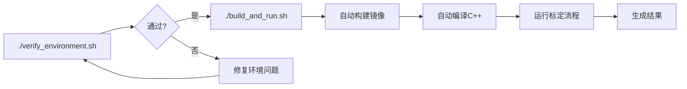

# 快速参考 - 一键编译和运行

## 最快开始

```bash
# 1. 验证环境
./verify_environment.sh

# 2. 一键编译和运行（包含标定流程）
./build_and_run.sh
```

## 常用命令

| 任务 | 命令 |
|------|------|
| 完整流程 | `./build_and_run.sh` |
| 仅构建 | `./build_and_run.sh --build-only` |
| 仅运行 | `./build_and_run.sh --run-only` |
| 交互式Shell | `./build_and_run.sh --shell` |
| 环境检查 | `./verify_environment.sh` |
| 查看帮助 | `./build_and_run.sh --help` |

## 环境变量

```bash
# 自定义数据目录
CALIB_DATA_DIR=/path/to/data ./build_and_run.sh

# 自定义结果目录
CALIB_RESULTS_DIR=/path/to/results ./build_and_run.sh

# 组合使用
CALIB_DATA_DIR=/data \
CALIB_RESULTS_DIR=/output \
./build_and_run.sh
```

## 目录结构

```
calibration/
├── build_and_run.sh           # 主脚本
├── verify_environment.sh       # 环境检查脚本
├── BUILD_AND_RUN_GUIDE.md     # 详细指南
├── unicalib_C_plus_plus/       # C++ 主框架
│   ├── CMakeLists.txt
│   ├── config/
│   │   └── sensors.yaml      # 配置文件
│   └── src/
└── data/                      # 标定数据目录
```

## 数据准备

### 最小数据结构

```
data/
├── camera/
│   ├── cam0/images/
│   │   ├── 000000.jpg
│   │   ├── 000001.jpg
│   │   └── ...
│   └── cam1/images/
│       └── ...
└── lidar/
    ├── scan001.pcd
    ├── scan002.pcd
    └── ...
```

## 配置文件位置

- **传感器配置**: `unicalib_C_plus_plus/config/sensors.yaml`
- **CMake配置**: `unicalib_C_plus_plus/CMakeLists.txt`
- **Docker配置**: `docker/Dockerfile`

## 结果输出

标定完成后，结果保存在 `${CALIB_RESULTS_DIR}`（默认: `/tmp/calib_results`）：

```
results/
├── intrinsic/           # 内参标定结果
├── extrinsic/          # 外参标定结果
├── refined_extrinsic/  # 精外参结果
└── logs/               # 运行日志
```

## 故障排查

| 问题 | 解决方案 |
|------|----------|
| Docker 镜像不存在 | 自动构建，或手动运行 `cd docker && ./docker_build.sh` |
| C++ 编译失败 | 进入Shell: `./build_and_run.sh --shell`，手动编译查看详细错误 |
| 数据路径错误 | 检查 `CALIB_DATA_DIR` 环境变量，确保数据目录存在且包含正确格式的数据 |
| GPU 不可用 | 检查 nvidia-docker 安装: `docker run --rm --gpus all nvidia/cuda:11.8.0-base-ubuntu22.04 nvidia-smi` |
| GUI 不可用 | 设置 X11 权限: `xhost +local:docker`，确保 `DISPLAY` 环境变量已设置 |

## 性能优化

```bash
# 多核编译
cd unicalib_C_plus_plus/build
make -j$(nproc)

# 使用 SSD 存储数据
CALIB_DATA_DIR=/ssd/data ./build_and_run.sh

# GPU 加速（确保 nvidia-docker 正确配置）
docker run --gpus all ...
```

## 清理命令

```bash
# 清理 Docker 容器
docker-compose -f docker/docker-compose.yaml down

# 清理编译缓存
cd unicalib_C_plus_plus/build
make clean

# 清理标定结果
rm -rf /tmp/calib_results/*
```

## 详细文档

- **详细使用指南**: [BUILD_AND_RUN_GUIDE.md](BUILD_AND_RUN_GUIDE.md)
- **项目主文档**: [README.md](README.md)
- **C++框架文档**: [unicalib_C_plus_plus/README.md](unicalib_C_plus_plus/README.md)
- **C++构建文档**: [unicalib_C_plus_plus/BUILD_AND_RUN.md](unicalib_C_plus_plus/BUILD_AND_RUN.md)

## 工作流程图


