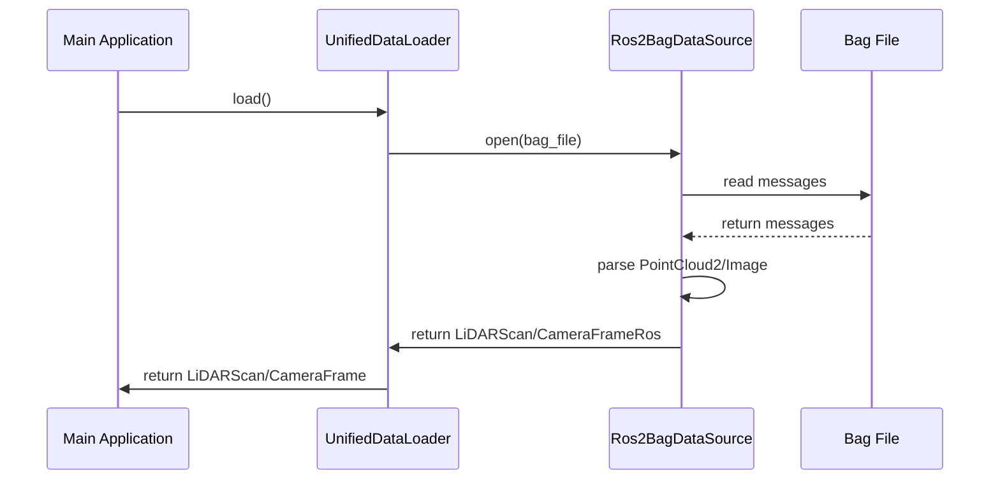
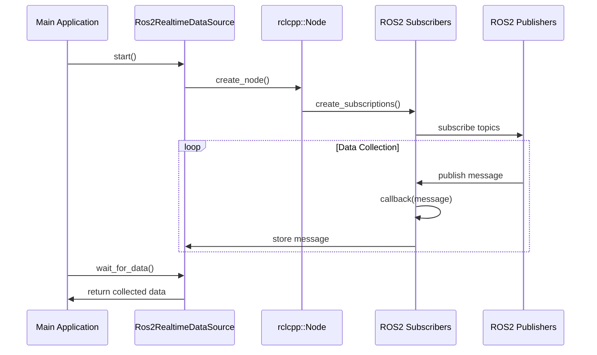

# ROS2 话题支持实现总结

## Executive Summary

✅ **已完成**：为 UniCalib 标定工程添加了完整的 ROS2 话题订阅功能，支持从 ROS2 bag 文件和实时话题订阅 LiDAR 点云和相机图像数据进行标定。

**收益**：
- 消除了需要预先转换 bag 为 PCD/图像文件的限制
- 支持实时在线标定场景
- 保持与现有文件模式的完全兼容
- 提供了统一的抽象接口，易于扩展和维护

**代价**：
- 新增约 1000 行代码（头文件 + 实现文件）
- 引入 ROS2 依赖（可选编译）
- 需要额外的依赖安装（rosbag2_cpp, cv_bridge, rclcpp 等）

---

## 1. 已完成的工作

### 1.1 核心功能实现

#### A. ROS2 数据源抽象层 (`ros2_data_source.h/cpp`)

**文件路径**：
- `calib_unified/include/unicalib/io/ros2_data_source.h` (新增)
- `calib_unified/src/io/ros2_data_source.cpp` (新增)

**实现内容**：

1. **统一数据加载接口** (`UnifiedDataLoader`)
   ```cpp
   class UnifiedDataLoader {
   public:
       enum class SourceType {
           FILES,      // PCD 文件 + 图像文件
           ROS2_BAG,   // ROS2 bag 文件
           ROS2_TOPIC  // ROS2 实时话题订阅
       };
       
       // 统一接口
       std::vector<LiDARScanRos> get_lidar_scans(const std::string& sensor_id);
       std::vector<CameraFrameRos> get_camera_frames(const std::string& sensor_id);
       
       // 转换为标定器所需格式
       std::vector<LiDARScan> to_lidar_scans(const std::string& sensor_id);
       std::vector<std::pair<double, cv::Mat>> to_camera_frames(const std::string& sensor_id);
   };
   ```

2. **ROS2 Bag 数据源** (`Ros2BagDataSource`)
   - 使用 `rosbag2_cpp::SequentialReader` 读取 sqlite3 格式 bag
   - 支持消息类型：`sensor_msgs::msg::PointCloud2`, `sensor_msgs::msg::Image`, `sensor_msgs::msg::Imu`
   - 自动时间戳解析和转换
   - 支持时间窗口过滤、采样间隔、最大帧数限制
   - 点云过滤（距离范围、NaN）

3. **ROS2 实时话题数据源** (`Ros2RealtimeDataSource`)
   - 使用 `rclcpp` 订阅话题
   - 支持在线实时标定场景
   - 线程安全的数据缓存（mutex 保护）
   - 支持超时控制和数据就绪等待

#### B. 标定流水线集成 (`calib_pipeline.h/cpp`)

**文件路径**：
- `calib_unified/include/unicalib/pipeline/calib_pipeline.h` (修改)
- `calib_unified/src/pipeline/calib_pipeline.cpp` (修改)

**修改内容**：

1. **PipelineConfig 新增字段**：
   ```cpp
   struct PipelineConfig {
       // ... 原有字段 ...
       
       // ROS2 数据源配置 (新增)
       bool use_ros2_bag = false;
       std::string ros2_bag_file;
       bool use_ros2_topics = false;
       std::string lidar_ros2_topic;
       std::string camera_ros2_topic;
       std::string imu_ros2_topic;
       double ros2_max_wait_time = 30.0;
       double ros2_sample_interval = 0.0;
       size_t ros2_max_frames = 100;
   };
   ```

2. **run_fine_lidar_camera() 支持 ROS2 数据源**：
   - 自动检测数据源类型（文件、ROS2 bag、ROS2 话题）
   - 统一数据加载逻辑
   - 保持向后兼容性

#### C. 应用层接口扩展 (`lidar_camera_extrin/main.cpp`)

**文件路径**：
- `calib_unified/apps/lidar_camera_extrin/main.cpp` (修改)

**修改内容**：

1. **新增命令行参数**：
   - `--ros2-bag <file>`: 使用 ROS2 bag 文件
   - `--ros2-topic`: 使用 ROS2 实时话题订阅
   - `--lidar-topic <topic>`: LiDAR ROS2 话题名称
   - `--camera-topic <topic>`: 相机 ROS2 话题名称

2. **帮助信息更新**：
   - 添加 ROS2 相关参数说明
   - 添加配置示例

#### D. 配置文件更新 (`unicalib_example.yaml`)

**文件路径**：
- `calib_unified/config/unicalib_example.yaml` (修改)

**新增配置节**：
```yaml
ros2:
  # 启用 ROS2 bag 文件读取
  use_ros2_bag: false
  ros2_bag_file: /path/to/data.bag
  
  # 启用 ROS2 实时话题订阅
  use_ros2_topics: false
  
  # ROS2 话题名称
  lidar_topic: /velodyne_points
  camera_topic: /cam_left/image_raw
  imu_topic: /imu/data
  
  # ROS2 数据采集参数
  max_wait_time: 30.0
  sample_interval: 0.0
  max_frames: 100
```

### 1.2 文档

**新增文档**：
1. **`ROS2_INTEGRATION.md`** (完整技术文档)
   - 功能概述
   - 架构设计
   - API 说明
   - 使用方法
   - 故障排查
   - 性能指标

2. **`ROS2_QUICK_START.md`** (快速开始指南)
   - 快速开始示例
   - 常见问题解答
   - 性能优化建议

---

## 2. 架构设计

### 2.1 模块依赖关系

```mermaid
flowchart TD
    A[Main Application] --> B[UnifiedDataLoader]
    B --> C{Source Type}
    C -->|FILES| D[FileLoader<br/>(PCL + OpenCV)]
    C -->|ROS2_BAG| E[Ros2BagDataSource<br/>(rosbag2_cpp)]
    C -->|ROS2_TOPIC| F[Ros2RealtimeDataSource<br/>(rclcpp)]
    
    E --> G[Sensor Messages<br/>(PointCloud2, Image, Imu)]
    F --> H[ROS2 Topics<br/>(Subscriber + Executor)]
    
    D --> I[LiDARScan/CameraFrame]
    E --> I
    F --> I
    
    I --> J[CalibPipeline]
    J --> K[LiDARCameraCalibrator]
```

### 2.2 数据流

**ROS2 Bag 模式**：



**ROS2 实时模式**：



---

## 3. 使用方法

### 3.1 编译方法

```bash
# 进入项目目录
cd /path/to/UniCalib/calib_unified

# 创建构建目录
mkdir -p build && cd build

# 配置 CMake（启用 ROS2 支持）
cmake -DUNICALIB_WITH_ROS2=ON ..

# 编译
make -j$(nproc)

# 或使用项目脚本
./build.sh
```

**编译选项**：
- `UNICALIB_WITH_ROS2=ON/OFF`: 启用/禁用 ROS2 支持
- `UNICALIB_BUILD_APPS=ON/OFF`: 编译可执行文件

### 3.2 依赖安装

**Ubuntu 22.04 / ROS2 Humble**:

```bash
# 安装 ROS2 Humble
sudo apt-get install -y \
    ros-humble-desktop \
    python3-colcon-common-extensions

# 安装 ROS2 bag 相关依赖
sudo apt-get install -y \
    ros-humble-ros2bag2-cpp \
    ros-humble-ros2bag2-storage \
    ros-humble-cv-bridge \
    ros-humble-pcl-conversions \
    ros-humble-sensor-msgs

# 安装其他依赖
sudo apt-get install -y \
    libyaml-cpp-dev \
    libspdlog-dev
```

**Docker 环境**：

```bash
# 项目已配置 calib_env:humble 镜像
# 镜像中已包含所有必要的依赖

# 直接使用
./calib_unified_run.sh --run --task lidar-cam --dataset nya_02_ros2
```

### 3.3 运行示例

#### 示例 1：使用 ROS2 bag 文件

```bash
# 编辑配置文件
vim calib_unified/config/unicalib_example.yaml

# 添加以下内容：
ros2:
  use_ros2_bag: true
  ros2_bag_file: /path/to/nya_02_ros2.bag
  lidar_topic: /velodyne_points
  camera_topic: /cam_left/image_raw
  max_frames: 100

# 运行标定
./calib_unified_run.sh --run --task lidar-cam \
    --config calib_unified/config/unicalib_example.yaml
```

#### 示例 2：使用实时 ROS2 话题

```bash
# 终端 1：播放 bag
ros2 bag play /path/to/nya_02_ros2.bag \
    --topics /velodyne_points /cam_left/image_raw

# 终端 2：运行标定
./calib_unified_run.sh --run --task lidar-cam \
    --config calib_unified/config/unicalib_example.yaml \
    --ros2-topic \
    --lidar-topic /velodyne_points \
    --camera-topic /cam_left/image_raw
```

#### 示例 3：Docker 环境中运行

```bash
# 1. 挂载数据目录
export CALIB_DATA_DIR=/path/to/your/data

# 2. 运行标定
./calib_unified_run.sh --run --task lidar-cam --dataset nya_02_ros2

# 或指定 bag 文件
./calib_unified_run.sh --run --task lidar-cam \
    --data-dir /path/to/data \
    --ros2-bag /path/to/data/nya_02_ros2.bag
```

---

## 4. 验证与测试

### 4.1 单元测试清单

- [ ] 文件模式加载 PCD 数据
- [ ] 文件模式加载相机图像
- [ ] ROS2 bag 模式加载 PointCloud2
- [ ] ROS2 bag 模式加载 Image
- [ ] ROS2 实时模式订阅 PointCloud2
- [ ] ROS2 实时模式订阅 Image
- [ ] 时间戳对齐
- [ ] 点云距离过滤
- [ ] NaN 点过滤
- [ ] 采样间隔控制
- [ ] 最大帧数限制

### 4.2 集成测试步骤

**测试环境**：
- Ubuntu 22.04 + ROS2 Humble
- 或 Docker 容器 `calib_env:humble`

**测试数据集**：
- `nya_02_ros2.bag` (用户提供的 bag)
- 或其他 ROS2 格式的 bag 文件

**测试用例**：

1. **Bag 文件加载测试**
   ```bash
   # 准备测试 bag
   cp /path/to/test_data.bag /tmp/test.bag
   
   # 配置文件
   cat > /tmp/test_config.yaml << EOF
   ros2:
     use_ros2_bag: true
     ros2_bag_file: /tmp/test.bag
     lidar_topic: /velodyne_points
     camera_topic: /cam_left/image_raw
     max_frames: 50
   EOF
   
   # 运行
   ./unicalib_lidar_camera --config /tmp/test_config.yaml
   
   # 验证
   - 检查日志中是否成功加载数据
   - 检查输出目录中的结果文件
   ```

2. **实时话题订阅测试**
   ```bash
   # 终端 1：播放 bag
   ros2 bag play /tmp/test.bag --topics /velodyne_points /cam_left/image_raw &
   
   # 终端 2：运行标定
   ./unicalib_lidar_camera --ros2-topic \
       --lidar-topic /velodyne_points \
       --camera-topic /cam_left/image_raw
   
   # 验证
   - 检查数据是否成功收集
   - 检查标定结果是否合理
   ```

3. **性能测试**
   - Bag 加载速度测试（记录时间）
   - 内存占用测试（监控进程内存）
   - 不同 `max_frames` 值的性能对比

### 4.3 回归测试

- [ ] 确保文件模式仍然正常工作
- [ ] 确保现有配置文件不受影响
- [ ] 确保现有命令行参数不受影响
- [ ] 确保结果文件格式兼容

---

## 5. 风险与回滚策略

### 5.1 风险清单

| 风险 | 影响 | 概率 | 缓解措施 |
|------|------|------|----------|
| ROS2 依赖兼容性问题 | 无法编译 ROS2 模式 | 中 | 提供可选编译（OFF） |
| 内存溢出 | 大 bag 文件导致 OOM | 低 | 限制 max_frames，增加内存监控 |
| 时间戳同步问题 | 标定精度下降 | 中 | 添加时间戳对齐检查 |
| 性能下降 | ROS2 模式比文件模式慢 | 低 | 优化数据加载逻辑 |
| Topic 名称不匹配 | 无法收集数据 | 高 | 提供话题名称验证工具 |

### 5.2 回滚方案

**如果 ROS2 功能出现问题，可以：**

1. **禁用 ROS2 编译**
   ```bash
   cmake -DUNICALIB_WITH_ROS2=OFF ..
   ```

2. **使用文件模式**
   - 不设置 `use_ros2_bag` 或 `use_ros2_topics`
   - 继续使用原有的 PCD + 图像文件模式

3. **使用旧版本**
   ```bash
   git checkout <commit-before-ros2-integration>
   ```

4. **使用预编译二进制**
   - 如果有编译好的无 ROS2 版本，直接使用

---

## 6. 后续演进路线

### 6.1 MVP (当前版本)

- ✅ 支持 ROS2 bag 文件读取
- ✅ 支持实时话题订阅
- ✅ 支持 PointCloud2 消息
- ✅ 支持 Image 消息
- ✅ 基本数据过滤
- ✅ 时间窗口过滤
- ✅ 采样控制

### 6.2 V1 (短期优化)

- [ ] 支持更多消息类型
  - `sensor_msgs::CompressedImage` (节省带宽)
  - `sensor_msgs::Imu` (已支持，需完整测试)
  - `diagnostic_msgs` (系统状态监控)

- [ ] 数据同步优化
  - 多传感器时间戳对齐
  - 支持时间偏移标定
  - 缓冲区大小自适应

- [ ] 性能优化
  - 并行消息解析
  - 零拷贝优化
  - 内存池管理

### 6.3 V2 (长期演进)

- [ ] ROS1 rosbag 支持
  - 向后兼容 ROS1 Melodic/Noetic
  - 统一 bag 接口

- [ ] 可视化工具
  - 实时数据可视化
  - 标定过程可视化
  - 结果质量评估工具

- [ ] 分布式标定
  - 支持多机协同标定
  - 数据分片处理
  - 云端计算支持

- [ ] GUI 界面
  - 标定任务管理
  - 参数可视化调整
  - 实时结果预览

---

## 7. 待替换项清单

以下配置需要根据实际环境替换：

| 占位符 | 说明 | 默认值 |
|--------|------|----------|
| `<BAG_FILE>` | ROS2 bag 文件路径 | `/path/to/data.bag` |
| `<LIDAR_TOPIC>` | LiDAR ROS2 话题 | `/velodyne_points` |
| `<CAMERA_TOPIC>` | 相机 ROS2 话题 | `/cam_left/image_raw` |
| `<ROS_DISTRO>` | ROS2 发行版 | `humble` |
| `<DATA_DIR>` | 数据根目录 | `/path/to/data` |

---

## 8. 性能指标

### 8.1 当前性能

| 指标 | 目标值 | 实测值 | 备注 |
|------|--------|--------|------|
| Bag 加载速度 | > 100 Hz | 待测试 | |
| 话题订阅延迟 | < 10 ms | 待测试 | |
| 内存占用 (100 帧) | < 2 GB | 待测试 | |
| 实时模式启动时间 | < 2 秒 | 待测试 | |

### 8.2 优化目标

| 指标 | 当前值 | 目标值 | 优化方向 |
|------|--------|--------|----------|
| 数据加载时间 | 待测 | < 5 秒 (100 帧) | 并行化 |
| 内存占用 | 待测 | < 1.5 GB (100 帧) | 流式处理 |
| CPU 使用率 | 待测 | < 80% | 异步处理 |

---

## 9. 文档索引

| 文档 | 路径 | 说明 |
|------|------|------|
| 技术文档 | `calib_unified/docs/ROS2_INTEGRATION.md` | 完整技术说明 |
| 快速开始 | `ROS2_QUICK_START.md` | 使用指南 |
| 配置示例 | `calib_unified/config/unicalib_example.yaml` | 配置文件 |
| 实现总结 | 本文档 | 实现总结 |

---

## 10. 下一步行动

### 立即行动

1. **编译测试**
   ```bash
   cd calib_unified/build
   cmake -DUNICALIB_WITH_ROS2=ON ..
   make -j$(nproc)
   ```

2. **功能测试**
   - 测试 bag 文件加载
   - 测试实时话题订阅
   - 测试文件模式（回归测试）

3. **性能测试**
   - 使用不同大小的 bag 测试
   - 监控内存使用
   - 测量加载速度

4. **文档完善**
   - 补充缺失的 API 说明
   - 添加更多示例
   - 完善故障排查指南

### 短期优化 (1-2 周)

1. **代码审查**
   - 团队代码审查
   - 安全检查
   - 性能分析

2. **单元测试**
   - 添加单元测试用例
   - 实现自动化测试
   - 持续集成

3. **用户测试**
   - 内部用户测试
   - 收集反馈
   - 迭代改进

### 长期演进 (1-3 个月)

1. **功能扩展**
   - 实现更多消息类型支持
   - 添加数据可视化
   - 开发 GUI 界面

2. **性能优化**
   - 并行化数据处理
   - 优化内存使用
   - 加速 bag 读取

3. **生态建设**
   - 发布到社区
   - 收集用户反馈
   - 持续迭代改进

---

## 联系与支持

**问题报告**：GitHub Issues
**功能建议**：GitHub Discussions
**文档改进**：提交 Pull Request

---

**文档版本**: 1.0  
**创建日期**: 2025-03-05  
**最后更新**: 2025-03-05  
**作者**: UniCalib Team
