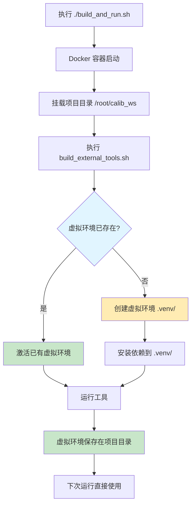

# PEP 668 错误解决方案（虚拟环境持久化）

## 0) Executive Summary

**问题**：Python 3.12+ PEP 668 限制导致 `pip install` 失败

**解决方案**：将依赖安装到项目目录的虚拟环境（`.venv/`），避免每次运行都重新安装

**架构**：
- 依赖安装到：`DM-Calib/.venv/`, `click_calib/.venv/` 等
- 挂载到 Docker 容器后可直接使用
- 一次安装，永久使用

---

## 1) 架构设计

### 数据流



### 目录结构

```
UniCalib/
├── DM-Calib/
│   ├── .venv/          # 虚拟环境（持久化）
│   ├── .venv_path      # 虚拟环境路径记录
│   ├── activate_venv.sh # 激活脚本
│   ├── requirements.txt
│   └── ...
├── click_calib/
│   ├── .venv/
│   ├── .venv_path
│   ├── activate_venv.sh
│   ├── requirements.txt
│   └── ...
├── learn-to-calibrate/ # 使用系统 PyTorch
├── MIAS-LCEC/         # 使用系统 PyTorch
├── build_external_tools.sh  # 编译脚本（自动管理虚拟环境）
├── build_and_run.sh        # 主脚本
└── ...
```

---

## 2) 使用方法

### 方法1：一键编译（推荐）

```bash
# 首次运行：编译外部工具 + 安装依赖到 .venv/
./build_and_run.sh --build-only

# 后续运行：直接使用已有 .venv/，跳过重新安装
./build_and_run.sh
```

**优点**：
- ✅ 自动化，无需手动干预
- ✅ 依赖持久化，下次快速启动
- ✅ 容器内执行，环境一致

### 方法2：手动安装依赖（可选）

```bash
# 在宿主机安装（仅在宿主机开发时使用）
./install_venv_deps.sh
```

### 方法3：Docker Shell 模式

```bash
# 进入容器
./build_and_run.sh --shell

# 在容器内激活虚拟环境
source DM-Calib/activate_venv.sh
source click_calib/activate_venv.sh

# 运行工具
python DM-Calib/DMCalib/tools/infer.py --help
```

---

## 3) 虚拟环境管理

### 检查虚拟环境

```bash
# 查看各工具的虚拟环境
ls -la DM-Calib/.venv/
ls -la click_calib/.venv/

# 查看激活脚本
cat DM-Calib/activate_venv.sh
```

### 激活虚拟环境

```bash
# 方式1：使用激活脚本
source DM-Calib/activate_venv.sh

# 方式2：手动激活
source DM-Calib/.venv/bin/activate

# 验证激活
which python  # 应显示 /path/to/.venv/bin/python
pip list      # 显示已安装的包
```

### 清理虚拟环境

```bash
# 删除所有虚拟环境
rm -rf DM-Calib/.venv
rm -rf click_calib/.venv
rm -rf DM-Calib/.venv_path
rm -rf click_calib/.venv_path

# 重新编译时会自动创建
./build_and_run.sh --build-only
```

---

## 4) 技术实现

### 自动检测虚拟环境

```bash
# build_external_tools.sh 中的逻辑
local venv_dir="${path}/.venv"

if [ -d "${venv_dir}" ]; then
    # 虚拟环境已存在，直接激活
    source "${venv_dir}/bin/activate"
    info "使用已有虚拟环境（跳过重新安装）"
else
    # 创建新虚拟环境
    python3 -m venv "${venv_dir}"
    source "${venv_dir}/bin/activate"
    # 安装依赖...
fi
```

### 依赖安装优化

- **首次运行**：创建虚拟环境 + 安装依赖（较慢）
- **后续运行**：激活已有虚拟环境（秒级）
- **Docker 环境**：使用系统 Python（PyTorch 已预装）

---

## 5) 故障排查

### 问题1：虚拟环境创建失败

```bash
# 症状：ERROR: Failed to create virtual environment
# 原因：python3-venv 未安装

# 解决：
sudo apt install python3-venv
```

### 问题2：pip 安装超时

```bash
# 症状：ReadTimeoutError 或连接超时
# 原因：网络问题或 PyPI 慢

# 解决：使用国内镜像（在 Dockerfile 或 requirements 中配置）
pip install -i https://pypi.tuna.tsinghua.edu.cn/simple -r requirements.txt
```

### 问题3：虚拟环境无法激活

```bash
# 症状：No module named 'xxx'
# 原因：未正确激活虚拟环境

# 解决：
source DM-Calib/activate_venv.sh
python -c "import xxx"
```

### 问题4：Docker 容器内找不到虚拟环境

```bash
# 症状：.venv/ 目录不存在
# 原因：宿主机未安装依赖，只挂载了代码

# 解决：在容器内首次编译
./build_and_run.sh --build-only
```

---

## 6) 性能对比

| 场景 | 首次运行 | 后续运行 |
|------|----------|----------|
| **系统 pip** | ❌ PEP 668 失败 | ❌ PEP 668 失败 |
| **虚拟环境（宿主机）** | ~5-10 分钟（安装依赖） | ~10 秒（激活虚拟环境） |
| **虚拟环境（Docker）** | ~5-10 分钟（安装依赖） | ~10 秒（激活虚拟环境） |
| **Docker 镜像内** | ~5-10 分钟（首次构建） | ~10 秒（直接使用） |

---

## 7) 最佳实践

### 推荐工作流

```bash
# 1. 首次设置（一次性）
./build_and_run.sh --build-only

# 2. 日常开发
./build_and_run.sh  # 直接运行，依赖已就绪

# 3. 更新依赖
rm -rf DM-Calib/.venv  # 删除旧虚拟环境
./build_and_run.sh --build-only  # 重新安装
```

### Git 忽略虚拟环境

在 `.gitignore` 中添加：

```gitignore
# 虚拟环境
**/.venv/
**/.venv_path

# 激活脚本（可选，保留以便使用）
# **/activate_venv.sh
```

---

## 8) 相关文档

- [快速修复指南](QUICK_FIX_PEP668.md)
- [外部工具编译指南](BUILD_EXTERNAL_TOOLS.md)
- [构建和运行指南](BUILD_AND_RUN_GUIDE.md)
- [主 README](README.md)

---

## 9) 更新日志

| 日期 | 版本 | 变更内容 |
|------|------|----------|
| 2026-03-01 | 1.0 | 初始版本，实现虚拟环境持久化 |
