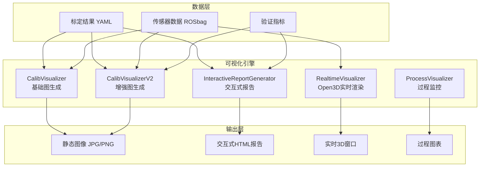
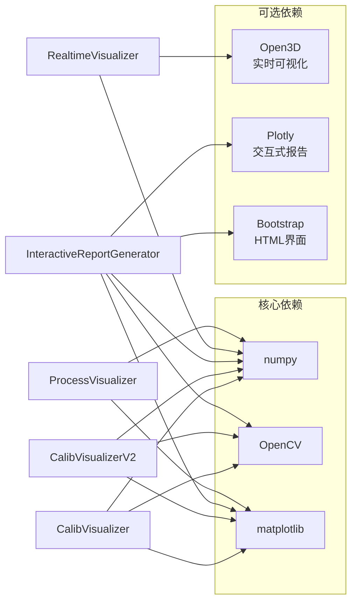
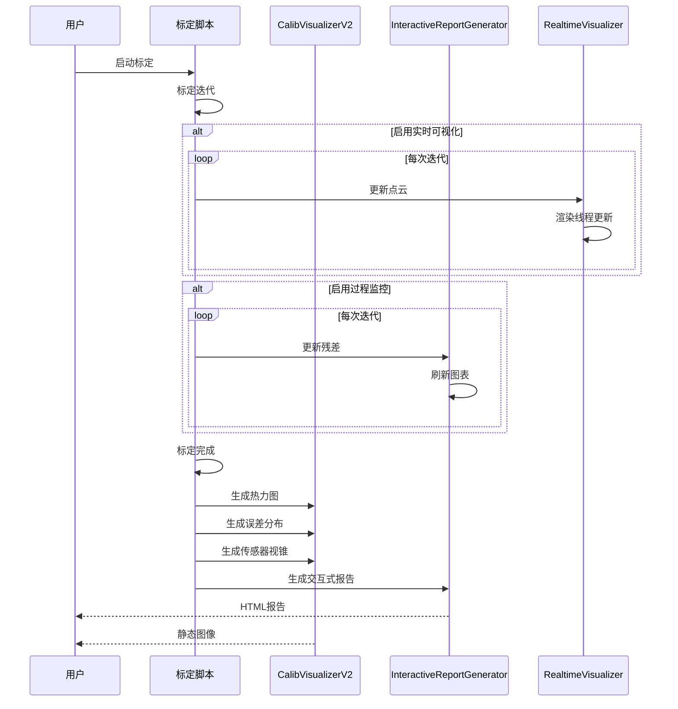

# UniCalib 可视化系统使用指南

## 目录

1. [概述](#概述)
2. [功能特性](#功能特性)
3. [架构设计](#架构设计)
4. [快速开始](#快速开始)
5. [API参考](#api参考)
6. [高级用法](#高级用法)
7. [故障排查](#故障排查)
8. [性能优化](#性能优化)

---

## 概述

UniCalib 可视化系统提供了一套完整的多传感器标定结果可视化解决方案，支持从静态图生成到实时交互式可视化的全方位展示。

### 核心模块

| 模块 | 功能描述 | 主要特性 |
|------|----------|----------|
| `CalibVisualizer` | 基础可视化（V1） | 投影叠加图、传感器概览图、BEV图 |
| `CalibVisualizerV2` | 增强可视化（V2） | 热力图投影、误差分布图、3D轨迹、多帧对比 |
| `InteractiveReportGenerator` | 交互式报告 | Plotly图表、3D浏览器、Bootstrap界面 |
| `RealtimeVisualizer` | 实时可视化（Open3D） | 实时点云渲染、传感器坐标系、视锥可视化 |
| `ProcessVisualizer` | 过程可视化 | 迭代残差曲线、优化进度实时显示 |
| `HybridVisualizer` | 混合可视化 | 3D + 过程图组合显示 |

---

## 功能特性

### 1. 静态图可视化

#### 1.1 热力图投影
- **功能**: 将LiDAR点云投影到图像，按深度或误差着色
- **输出**: JPG/PNG格式图像
- **参数**:
  - `max_depth`: 最大深度（用于归一化）
  - `point_size`: 点大小
  - `alpha`: 透明度
  - `colormap`: 颜色映射（支持OpenCV所有颜色映射）

#### 1.2 误差分布图
- **功能**: 显示重投影误差的统计分布
- **输出**: 包含直方图和CDF曲线的双子图
- **统计信息**:
  - 均值、中值、标准差、最大值
  - <1px 和 <2px 的比例
  - 合格阈值线

#### 1.3 传感器视锥图
- **功能**: 3D展示各传感器坐标系和相机视锥
- **支持**:
  - 多个针孔/鱼眼相机
  - LiDAR传感器位置
  - IMU参考系
  - 坐标轴可视化（RGB=XYZ）

#### 1.4 多帧对比图
- **功能**: 并排展示多帧投影结果
- **用途**: 
  - 标定前后对比
  - 不同迭代结果对比
  - 多相机系统统一视图

#### 1.5 残差收敛曲线
- **功能**: 展示优化过程中残差的收敛情况
- **特性**:
  - 线性 + 对数双尺度显示
  - 迭代统计信息
  - 改进百分比计算

#### 1.6 点云对齐可视化
- **功能**: 3D展示点云配准效果
- **特性**:
  - 变换前后对比
  - 颜色区分源/目标点云
  - 双视角并排显示

### 2. 交互式报告

#### 2.1 功能特性
- **Plotly交互式图表**:
  - 可缩放、平移、导出
  - 悬停显示详细信息
  - 支持多维度数据探索

- **3D传感器浏览器**:
  - 鼠标拖动旋转
  - 滚轮缩放
  - 双击隐藏/显示传感器

- **Bootstrap响应式界面**:
  - 移动端友好
  - 标签页导航
  - 精美卡片布局

#### 2.2 报告内容
- 总体摘要（状态、关键指标）
- 内参标定结果（表格）
- 外参标定结果（表格）
- 验证指标（交互式图表）
- 精度说明（参考对照表）

### 3. 实时可视化

#### 3.1 Open3D渲染引擎
- **实时点云渲染**:
  - 支持百万级点云流畅显示
  - 深度着色/自定义颜色
  - 动态更新（线程安全队列）

- **几何体可视化**:
  - 相机视锥（线框）
  - 坐标系（RGB轴）
  - 轨迹线（连续曲线）

- **交互控制**:
  - 相机视角参数设置
  - 几何体动态添加/删除
  - 渲染参数实时调整

#### 3.2 过程可视化
- **实时残差曲线**:
  - matplotlib动画更新
  - 支持自动缩放
  - 可保存为静态图

---

## 架构设计

### 系统架构图



### 模块依赖关系



### 数据流



---

## 快速开始

### 安装依赖

#### 基础依赖（必需）
```bash
pip install numpy opencv-python matplotlib scipy pyyaml
```

#### 可选依赖（推荐）
```bash
# 实时3D可视化
pip install open3d

# 交互式报告（如果需要本地生成）
pip install plotly

# 如果使用conda环境
conda install -c conda-forge open3d
```

### 基础使用示例

#### 示例1：生成静态图
```python
from unicalib.utils.visualization import CalibVisualizer
from unicalib.utils.visualization_v2 import CalibVisualizerV2

# 初始化可视化器
viz = CalibVisualizer("./output")
viz_v2 = CalibVisualizerV2("./output")

# 生成热力图投影
vis = viz_v2.draw_lidar_heatmap(
    img=image,
    pts_cam=points_camera,
    K=K,
    D=D,
    max_depth=50.0,
)
```

#### 示例2：生成交互式报告
```python
from unicalib.validation.interactive_report import InteractiveReportGenerator

report_gen = InteractiveReportGenerator("./output")
html_path = report_gen.generate_interactive_html(
    intrinsics=intrinsics,
    extrinsics=extrinsics,
    validation_metrics=validation,
    visualization_data=viz_data,
)
```

#### 示例3：实时可视化
```python
from unicalib.utils.realtime_visualizer import RealtimeVisualizer
import numpy as np

rt_viz = RealtimeVisualizer("My Calibration")

# 实时更新点云
for i in range(100):
    points = np.random.randn(1000, 3)
    rt_viz.update_pointcloud("cloud", points)
```

### 命令行使用

#### 生成基础可视化
```bash
python UniCalib/scripts/visualize_results_v2.py \
    --config config/unicalib_config.yaml \
    --results ./calib_results \
    --data ./data
```

#### 生成完整可视化（包括误差分布、残差曲线）
```bash
python UniCalib/scripts/visualize_results_v2.py \
    --config config/unicalib_config.yaml \
    --results ./calib_results \
    --data ./data \
    --full
```

#### 生成交互式HTML报告
```bash
python UniCalib/scripts/visualize_results_v2.py \
    --config config/unicalib_config.yaml \
    --results ./calib_results \
    --interactive
```

#### 实时可视化模式
```bash
python UniCalib/scripts/visualize_results_v2.py \
    --config config/unicalib_config.yaml \
    --results ./calib_results \
    --data ./data \
    --realtime
```

### 运行示例

所有示例代码位于 `UniCalib/scripts/calibration_with_visualization.py`。

```bash
# 运行示例1：基础可视化
python UniCalib/scripts/calibration_with_visualization.py 1

# 运行示例2：增强可视化
python UniCalib/scripts/calibration_with_visualization.py 2

# 运行示例3：实时可视化（需要Open3D）
python UniCalib/scripts/calibration_with_visualization.py 3

# 运行示例4：过程可视化
python UniCalib/scripts/calibration_with_visualization.py 4

# 运行示例5：交互式报告
python UniCalib/scripts/calibration_with_visualization.py 5

# 运行示例6：混合可视化
python UniCalib/scripts/calibration_with_visualization.py 6

# 运行所有示例
python UniCalib/scripts/calibration_with_visualization.py all
```

---

## API参考

### CalibVisualizerV2

#### `draw_lidar_heatmap()`
```python
def draw_lidar_heatmap(
    self,
    img: np.ndarray,
    pts_cam: np.ndarray,
    K: np.ndarray,
    D: np.ndarray,
    max_depth: float = 50.0,
    point_size: int = 3,
    alpha: float = 0.7,
    colormap: int = cv2.COLORMAP_JET,
    error_map: Optional[np.ndarray] = None,
) -> np.ndarray:
    """生成LiDAR点云热力图投影"""
```

#### `save_error_distribution_plot()`
```python
def save_error_distribution_plot(
    self,
    errors: np.ndarray,
    title: str = "Reprojection Error Distribution",
    filename: str = "error_distribution.png",
    threshold: float = 1.0,
):
    """保存误差分布直方图和CDF曲线"""
```

#### `save_sensor_frustum()`
```python
def save_sensor_frustum(
    self,
    sensors: Dict,
    intrinsics: Dict,
    extrinsics: Dict,
    camera_ids: Optional[List[str]] = None,
    lidar_ids: Optional[List[str]] = None,
    filename: str = "sensor_frustums.png",
):
    """保存传感器视锥和坐标系3D概览图"""
```

### InteractiveReportGenerator

#### `generate_interactive_html()`
```python
def generate_interactive_html(
    self,
    intrinsics: Dict,
    extrinsics: Dict,
    validation_metrics: Dict,
    visualization_data: Optional[Dict] = None,
) -> str:
    """生成交互式HTML报告，返回文件路径"""
```

### RealtimeVisualizer

#### `update_pointcloud()`
```python
def update_pointcloud(
    self,
    name: str,
    points: np.ndarray,
    colors: Optional[np.ndarray] = None,
    point_size: float = 2.0,
):
    """更新点云数据"""
```

#### `update_frustum()`
```python
def update_frustum(
    self,
    name: str,
    R: np.ndarray,
    t: np.ndarray,
    K: np.ndarray,
    image_size: Tuple[int, int],
    depth: float = 5.0,
    color: Tuple[float, float, float] = (0.0, 1.0, 1.0),
):
    """更新相机视锥"""
```

#### `update_coordinate_frame()`
```python
def update_coordinate_frame(
    self,
    name: str,
    R: np.ndarray,
    t: np.ndarray,
    scale: float = 1.0,
):
    """更新坐标系"""
```

---

## 高级用法

### 1. 自定义颜色映射

```python
import cv2

# 使用不同的颜色映射
heatmaps = {
    'jet': cv2.COLORMAP_JET,
    'hot': cv2.COLORMAP_HOT,
    'rainbow': cv2.COLORMAP_RAINBOW,
    'viridis': cv2.COLORMAP_VIRIDIS,
}

for name, cmap in heatmaps.items():
    vis = viz_v2.draw_lidar_heatmap(
        img, pts_cam, K, D,
        colormap=cmap,
    )
    cv2.imwrite(f"heatmap_{name}.jpg", vis)
```

### 2. 误差着色热力图

```python
# 计算重投影误差
reproj_errors = compute_reprojection_errors(pts_cam, img, K, D)

# 使用误差着色
vis = viz_v2.draw_lidar_heatmap(
    img, pts_cam, K, D,
    error_map=reproj_errors,  # 优先使用误差着色
)
```

### 3. 实时标定可视化集成

```python
from unicalib.utils.realtime_visualizer import HybridVisualizer

# 初始化混合可视化器
hybrid_viz = HybridVisualizer(
    enable_3d=True,
    enable_process=True,
)

# 在标定循环中
for iteration in range(max_iterations):
    # 执行标定步骤
    residual = optimize_one_step()
    
    # 更新可视化
    hybrid_viz.update_pointcloud("cloud", current_points)
    hybrid_viz.update_process(residual)

# 标定完成后关闭
hybrid_viz.close()
```

### 4. 批量生成报告

```python
from unicalib.validation.interactive_report import InteractiveReportGenerator
from pathlib import Path

results_dir = Path("./calibration_results")
for result_subdir in results_dir.iterdir():
    if result_subdir.is_dir():
        report_gen = InteractiveReportGenerator(str(result_subdir))
        # ... 加载标定结果
        report_gen.generate_interactive_html(
            intrinsics, extrinsics, validation, viz_data
        )
```

---

## 故障排查

### 问题1：matplotlib不可用
**症状**: 无法生成静态图
**解决方案**:
```bash
pip install matplotlib
```

### 问题2：Open3D不可用
**症状**: 实时可视化无法启动
**解决方案**:
```bash
# 方法1：pip安装
pip install open3d

# 方法2：conda安装
conda install -c conda-forge open3d

# 方法3：从源码编译（如果上述方法失败）
# 参见: https://github.com/isl-org/Open3D
```

### 问题3：内存不足
**症状**: 处理大量点云时崩溃
**解决方案**:
```python
# 降采样点云
from unicalib.utils import downsample_pointcloud
points_downsampled = downsample_pointcloud(points, voxel_size=0.1)

# 分批处理
for chunk in split_into_chunks(points, chunk_size=100000):
    viz.update_pointcloud("cloud", chunk)
```

### 问题4：渲染性能低
**症状**: 实时可视化卡顿
**解决方案**:
```python
# 降低点云更新频率
import time
for i, points in enumerate(data_stream):
    if i % 5 == 0:  # 每5帧更新一次
        viz.update_pointcloud("cloud", points)
```

---

## 性能优化

### 1. 点云优化

```python
# 体素滤波降采样
def downsample_pointcloud(points, voxel_size=0.1):
    pcd = o3d.geometry.PointCloud()
    pcd.points = o3d.utility.Vector3dVector(points)
    downsampled = pcd.voxel_down_sample(voxel_size)
    return np.asarray(downsampled.points)

# 统计滤波去除离群点
def remove_outliers(points, nb_neighbors=20, std_ratio=2.0):
    pcd = o3d.geometry.PointCloud()
    pcd.points = o3d.utility.Vector3dVector(points)
    cl, ind = pcd.remove_statistical_outlier(nb_neighbors, std_ratio)
    return np.asarray(cl.points)
```

### 2. 图像缓存

```python
from functools import lru_cache

@lru_cache(maxsize=128)
def load_image_cached(path):
    return cv2.imread(path)
```

### 3. 并行处理

```python
from concurrent.futures import ThreadPoolExecutor

def process_frame(frame):
    # 处理单帧
    return result

with ThreadPoolExecutor(max_workers=4) as executor:
    results = list(executor.map(process_frame, frames))
```

---

## 总结

UniCalib 可视化系统提供了：
- ✅ **完整可视化链路**: 从静态图到实时交互
- ✅ **多维度展示**: 热力图、误差分布、3D视图
- ✅ **灵活集成**: 支持命令行和API调用
- ✅ **高性能**: 支持百万级点云实时渲染
- ✅ **易于使用**: 提供丰富的示例和文档

**下一步**:
1. 查看示例代码: `UniCalib/scripts/calibration_with_visualization.py`
2. 阅读API文档: 源码中的docstring
3. 运行完整流程: `UniCalib/scripts/visualize_results_v2.py --full`

**支持**:
- 问题反馈: GitHub Issues
- 功能建议: GitHub Discussions
- 技术交流: 项目README中的联系方式
