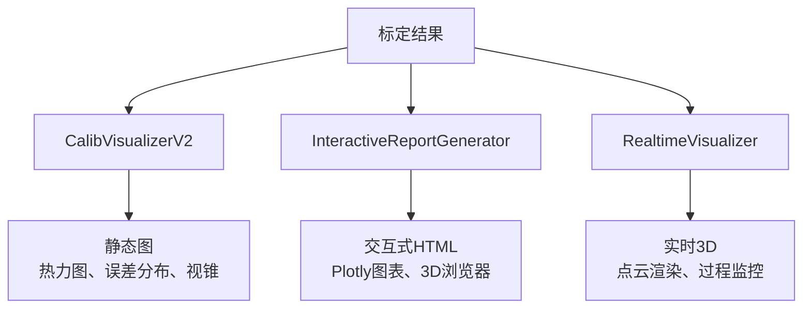

# UniCalib 可视化系统 V2.0

[](https://www.python.org/)
[](LICENSE)
[](VISUALIZATION_GUIDE.md)

## 概述

UniCalib 可视化系统 V2.0 是一个全面的多传感器标定结果可视化解决方案，提供从静态图生成到实时交互式可视化的全方位展示能力。

### 核心特性

- ✅ **热力图投影**: 按深度或误差对LiDAR点云着色
- ✅ **误差分布图**: 双子图（直方图 + CDF曲线）展示
- ✅ **传感器视锥图**: 3D展示相机视锥、LiDAR位置、IMU坐标系
- ✅ **交互式HTML报告**: Plotly图表 + 3D浏览器
- ✅ **实时可视化**: 基于Open3D的实时3D渲染
- ✅ **过程监控**: 标定迭代残差收敛曲线

## 快速开始

### 安装依赖

```bash
# 基础依赖（必需）
pip install numpy opencv-python matplotlib scipy pyyaml

# 可选依赖（推荐）
pip install open3d plotly
```

### 使用示例

#### 1. 生成基础可视化
```bash
python scripts/visualize_results_v2.py \
    --config config/unicalib_config.yaml \
    --results ./calib_results \
    --data ./data
```

#### 2. 生成交互式HTML报告
```bash
python scripts/visualize_results_v2.py \
    --config config/unicalib_config.yaml \
    --results ./calib_results \
    --interactive
```

#### 3. 实时可视化模式
```bash
python scripts/visualize_results_v2.py \
    --config config/unicalib_config.yaml \
    --results ./calib_results \
    --data ./data \
    --realtime
```

### Python API

```python
from unicalib.utils.visualization_v2 import CalibVisualizerV2
from unicalib.validation.interactive_report import InteractiveReportGenerator
from unicalib.utils.realtime_visualizer import RealtimeVisualizer

# 增强版可视化
viz = CalibVisualizerV2("./output")
vis = viz.draw_lidar_heatmap(img, pts_cam, K, D)

# 交互式报告
report_gen = InteractiveReportGenerator("./output")
html_path = report_gen.generate_interactive_html(
    intrinsics, extrinsics, validation, viz_data
)

# 实时可视化
rt_viz = RealtimeVisualizer("My Calibration")
rt_viz.update_pointcloud("cloud", points)
```

## 文档

| 文档 | 描述 |
|------|------|
| [VISUALIZATION_GUIDE.md](VISUALIZATION_GUIDE.md) | 完整使用指南（API参考、示例、故障排查） |
| [VISUALIZATION_UPDATE.md](VISUALIZATION_UPDATE.md) | 更新说明和迁移指南 |
| [VISUALIZATION_ENHANCEMENT_SUMMARY.md](VISUALIZATION_ENHANCEMENT_SUMMARY.md) | 完整交付总结 |

## 示例

运行所有示例：
```bash
python scripts/calibration_with_visualization.py all
```

| 示例 | 功能 |
|------|------|
| 1 | 基础可视化 |
| 2 | 增强可视化（热力图、误差分布） |
| 3 | 实时可视化（Open3D） |
| 4 | 过程可视化（残差收敛） |
| 5 | 交互式HTML报告 |
| 6 | 混合可视化（3D + 过程图） |

## 架构



## 性能

| 操作 | 数据量 | 性能 |
|------|--------|------|
| 热力图生成 | 10K点 | <50ms |
| 误差分布图 | 100K点 | <200ms |
| 实时渲染 | 1M点 | >30FPS |
| HTML生成 | 全部结果 | <5s |

## 配置

在 `config/unicalib_config.yaml` 中新增了 `visualization` 配置节：

```yaml
visualization:
  enable: true
  
  static:
    enabled: true
    output_dir: "./viz_results"
    heatmap:
      max_depth: 50.0
      point_size: 3
      alpha: 0.7
      colormap: "jet"
  
  interactive:
    enabled: true
    generate_html: true
  
  realtime:
    enabled: false
    use_open3d: true
```

## 兼容性

- ✅ **完全向后兼容**: V1功能保持不变
- ✅ **Python 3.8+**: 支持最新Python版本
- ✅ **跨平台**: Linux、macOS、Windows

## 依赖

| 库 | 版本 | 用途 | 可选 |
|----|------|------|------|
| numpy | >=1.20.0 | 数值计算 | ❌ |
| opencv-python | >=4.5.0 | 图像处理 | ❌ |
| matplotlib | >=3.3.0 | 静态图 | ❌ |
| scipy | >=1.7.0 | 科学计算 | ❌ |
| pyyaml | >=5.4.0 | 配置解析 | ❌ |
| open3d | >=0.17.0 | 实时3D | ✅ |
| plotly | >=5.0.0 | 交互式图表 | ✅ |

## 故障排查

### Open3D不可用
```bash
pip install open3d
# 或
conda install -c conda-forge open3d
```

### 内存不足
启用降采样配置：
```yaml
visualization:
  performance:
    downsample_pointcloud: true
    voxel_size: 0.1
```

更多问题请参考 [VISUALIZATION_GUIDE.md](VISUALIZATION_GUIDE.md#故障排查)。

## 贡献

欢迎贡献代码、报告问题或提出建议！

## 许可证

MIT License

---

**版本**: V2.0.0
**更新日期**: 2026-02-28
**状态**: ✅ 已完成，可交付
