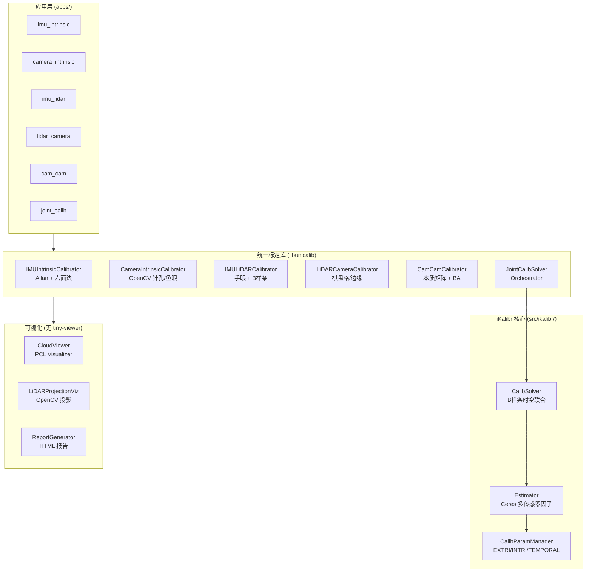

# UniCalib Unified — 多传感器统一标定系统

## Executive Summary

将 6 个开源标定工程深度整合为一个独立、无 ROS 强制依赖的 C++17 统一标定系统。支持五种标定类型，可独立运行也可联合优化。**彻底移除 tiny-viewer 依赖**，改用 PCL Visualizer + OpenCV + HTML 报告。

| 标定类型 | 算法来源 | 方法 |
|---|---|---|
| IMU 内参 | unicalib_C_plus_plus + iKalibr | Allan 方差 + 六面法 |
| 相机内参 (针孔/鱼眼) | unicalib_C_plus_plus | OpenCV calib3d/fisheye |
| IMU-LiDAR 外参 | iKalibr (B样条) | 手眼旋转 + B样条精化 |
| LiDAR-Camera 外参 | iKalibr + MIAS-LCEC | 棋盘格 / 边缘对齐 |
| Camera-Camera 外参 | click_calib 思路 | 本质矩阵 + Bundle Adjustment |
| **联合标定** | iKalibr CalibSolver | B样条连续时间时空联合优化 |

## 目录结构

```
calib_unified/
├── CMakeLists.txt          # 主构建配置
├── build.sh                # 一键编译脚本
├── config/                 # 配置示例文件
│   ├── joint_example.yaml
│   ├── imu_intrinsic_example.yaml
│   └── camera_intrinsic_example.yaml
├── include/
│   ├── unicalib/           # 新统一接口头文件
│   │   ├── common/         # 数据结构、日志、参数管理
│   │   ├── intrinsic/      # 内参标定接口
│   │   ├── extrinsic/      # 外参标定接口
│   │   ├── solver/         # 联合求解器
│   │   └── viz/            # 可视化 (PCL + OpenCV)
│   └── ikalibr/            # iKalibr 原始头文件 (含 viewer stub)
├── src/
│   ├── ikalibr/            # iKalibr 原始源码 (69 个 .cpp)
│   ├── common/             # 通用数据结构实现
│   ├── intrinsic/          # 内参标定实现
│   ├── extrinsic/          # 外参标定实现
│   ├── solver/             # 联合求解器实现
│   └── viz/                # 可视化实现 (无 tiny-viewer)
├── apps/                   # 6 个独立可执行程序
│   ├── imu_intrinsic/      # unicalib_imu_intrinsic
│   ├── camera_intrinsic/   # unicalib_camera_intrinsic
│   ├── imu_lidar_extrin/   # unicalib_imu_lidar
│   ├── lidar_camera_extrin/# unicalib_lidar_camera
│   ├── cam_cam_extrin/     # unicalib_cam_cam
│   └── joint_calib/        # unicalib_joint
└── thirdparty/             # 第三方库源码 (无符号链接)
    ├── Sophus/             # 李群/李代数 (header-only)
    ├── magic_enum/         # 枚举反射 (header-only)
    ├── cereal/             # 序列化 (header-only)
    ├── cereal_eigen_include/
    ├── veta-stub/          # 相机模型 stub (header-only)
    ├── tiny-viewer-stub/   # tiny-viewer 完全替代 (stub)
    ├── ctraj_full/         # B样条轨迹库 (有完整源码)
    ├── ceres-solver/       # 非线性优化 (完整源码)
    └── veta/               # 完整 veta 相机模型库
```

## 编译依赖

| 依赖 | 版本 | 说明 |
|---|---|---|
| CMake | ≥ 3.20 | 构建系统 |
| GCC/Clang | C++17 | 编译器 |
| **Eigen3** | ≥ 3.3 | 线性代数 (系统安装) |
| **Ceres Solver** | ≥ 2.0 | 非线性优化 (系统安装) |
| **OpenCV** | ≥ 4.0 | 图像处理 + 相机标定 |
| **PCL** | ≥ 1.12 | 点云处理 + 3D 可视化 |
| **spdlog** | ≥ 1.10 | 日志 (或 FetchContent 自动下载) |
| **yaml-cpp** | ≥ 0.7 | 配置解析 (或 FetchContent) |
| Sophus | - | 内含源码 (thirdparty/Sophus) |
| ctraj | - | 内含源码 (thirdparty/ctraj_full) |
| cereal | - | 内含源码 (thirdparty/cereal) |

**推荐: 在 Docker 容器中编译** (docker/Dockerfile 已包含所有依赖)

## 快速开始

```bash
# 1. 编译 (在 Docker 容器中)
cd /path/to/UniCalib/calib_unified
./build.sh

# 或者手动编译:
mkdir build && cd build
cmake .. -DCMAKE_BUILD_TYPE=Release
make -j$(nproc)

# 2. IMU 内参标定
./bin/unicalib_imu_intrinsic \
  --data_file /path/to/imu.csv \
  --sensor_id imu_0 \
  --output_dir ./output/imu

# 3. 相机内参标定
./bin/unicalib_camera_intrinsic \
  --images_dir /path/to/chessboard_images/ \
  --model pinhole \
  --sensor_id cam_0

# 4. IMU-LiDAR 外参标定
./bin/unicalib_imu_lidar \
  --config config/imu_lidar_example.yaml

# 5. LiDAR-Camera 外参标定
./bin/unicalib_lidar_camera \
  --config config/lidar_camera_example.yaml

# 6. Camera-Camera 外参标定
./bin/unicalib_cam_cam \
  --config config/cam_cam_example.yaml

# 7. 联合标定 (全传感器)
./bin/unicalib_joint \
  --config config/joint_example.yaml
```

## IMU 数据格式 (CSV)

```
# timestamp[s], gx[rad/s], gy[rad/s], gz[rad/s], ax[m/s²], ay[m/s²], az[m/s²]
1234567890.000, 0.001, -0.002, 0.003, 0.12, -0.05, 9.78
1234567890.005, 0.001, -0.002, 0.003, 0.12, -0.05, 9.78
...
```

## 输出格式

标定完成后在 `output_dir` 生成:

- `calibration_result.yaml` — 主标定结果 (人类可读)
- `calibration_result.json` — JSON 格式 (机器可读)
- `imu_intrinsic_{id}.yaml` — IMU 内参
- `camera_intrinsic_{id}.yaml` — 相机内参
- `allan_gyro.png` — Allan 偏差图
- `report.html` — 交互式 HTML 标定报告

## tiny-viewer 移除方案

原始 iKalibr 依赖 `tiny-viewer` 进行 3D 可视化。本项目通过以下方式彻底移除:

1. **viewer_stub.h** — `Viewer` 类继承自 `ns_viewer::MultiViewer` (空基类)，所有方法为 no-op
2. **viewer_types.h** — 完整的 `ns_viewer::` 类型 stub (`Colour`, `Entity`, `Coordinate` 等)
3. **ctraj tiny-viewer_stub** — ctraj 自带的轨迹查看器 stub
4. **新可视化** — `CloudViewer` (PCL Visualizer) + `LiDARProjectionViz` (OpenCV) 提供真实可视化

编译时设置: `IKALIBR_VIEWER_DISABLED=TRUE`

## 架构图



## 风险与已知限制

| 项目 | 状态 | 说明 |
|---|---|---|
| iKalibr B样条联合精化 | ⚠️ 框架就绪 | 需要 ROS2 bag 数据加载完整集成 |
| LiDAR 棋盘格检测 | ⚠️ 待完善 | 平面检测 + 角点提取算法 |
| 时间偏移精确估计 | ⚠️ 初步 | B样条精化中提供精确估计 |
| Camera-Camera BA | ⚠️ 框架 | 完整多视图 BA 待集成 |
| ROS bag 读取 | 可选 | 通过 --ros2 编译选项启用 |
| GPU 加速 | ❌ | 当前 CPU 实现 |
