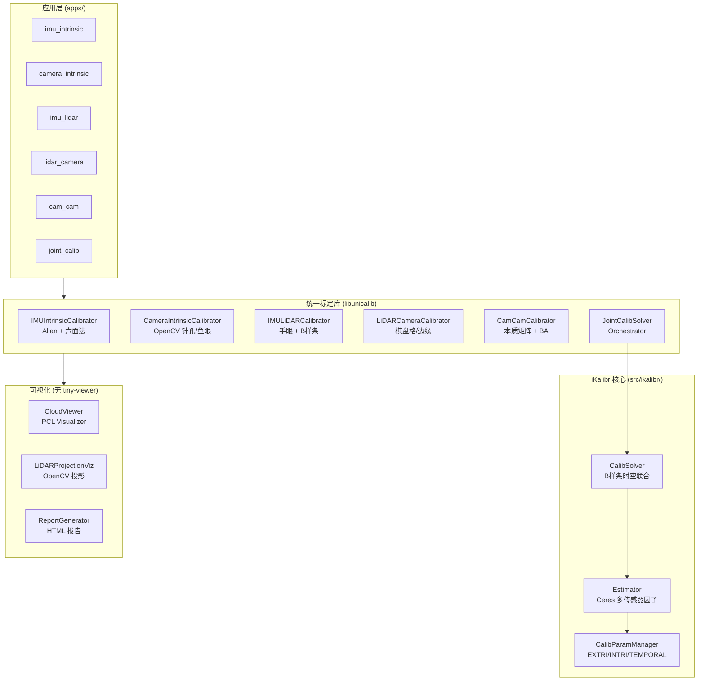

# UniCalib Unified — 多传感器统一标定系统

## Executive Summary

将 6 个开源标定工程深度整合为一个独立、无 ROS 强制依赖的 C++17 统一标定系统。支持五种标定类型，可独立运行也可联合优化。**彻底移除 tiny-viewer 依赖**，改用 PCL Visualizer + OpenCV + HTML 报告。

| 标定类型 | 算法来源 | 方法 |
|---|---|---|
| IMU 内参 | unicalib_C_plus_plus + iKalibr | Allan 方差 + 六面法；静态段不足时可选 Transformer-IMU-Calibrator 备选 |
| 相机内参 (针孔/鱼眼) | unicalib_C_plus_plus | OpenCV calib3d/fisheye |
| IMU-LiDAR 外参 | iKalibr (B样条) | 手眼旋转 + B样条精化 |
| LiDAR-Camera 外参 | iKalibr + MIAS-LCEC | 棋盘格 / 边缘对齐 |
| Camera-Camera 外参 | click_calib 思路 | 本质矩阵 + Bundle Adjustment |
| **联合标定** | iKalibr CalibSolver | B样条连续时间时空联合优化 |

## 目录结构

```
calib_unified/
├── CMakeLists.txt          # 主构建配置
├── build.sh                # 一键编译脚本
├── config/                 # 配置（全工程唯一）
│   └── unicalib_example.yaml   # 所有标定任务共用
├── include/
│   ├── unicalib/           # 新统一接口头文件
│   │   ├── common/         # 数据结构、日志、参数管理
│   │   ├── intrinsic/      # 内参标定接口
│   │   ├── extrinsic/      # 外参标定接口
│   │   ├── solver/         # 联合求解器
│   │   └── viz/            # 可视化 (PCL + OpenCV)
│   └── ikalibr/            # iKalibr 原始头文件 (含 viewer stub)
├── src/
│   ├── ikalibr/            # iKalibr 原始源码 (69 个 .cpp)
│   ├── common/             # 通用数据结构实现
│   ├── intrinsic/          # 内参标定实现
│   ├── extrinsic/          # 外参标定实现
│   ├── solver/             # 联合求解器实现
│   └── viz/                # 可视化实现 (无 tiny-viewer)
├── apps/                   # 6 个独立可执行程序
│   ├── imu_intrinsic/      # unicalib_imu_intrinsic
│   ├── camera_intrinsic/   # unicalib_camera_intrinsic
│   ├── imu_lidar_extrin/   # unicalib_imu_lidar
│   ├── lidar_camera_extrin/# unicalib_lidar_camera
│   ├── cam_cam_extrin/     # unicalib_cam_cam
│   └── joint_calib/        # unicalib_joint
└── thirdparty/             # 第三方库源码 (无符号链接)
    ├── Sophus/             # 李群/李代数 (header-only)
    ├── magic_enum/         # 枚举反射 (header-only)
    ├── cereal/             # 序列化 (header-only)
    ├── cereal_eigen_include/
    ├── veta-stub/          # 相机模型 stub (header-only)
    ├── tiny-viewer-stub/   # tiny-viewer 完全替代 (stub)
    ├── ctraj_full/         # B样条轨迹库 (有完整源码)
    ├── ceres-solver/       # 非线性优化 (完整源码)
    └── veta/               # 完整 veta 相机模型库
```

## 编译依赖

| 依赖 | 版本 | 说明 |
|---|---|---|
| CMake | ≥ 3.20 | 构建系统 |
| GCC/Clang | C++17 | 编译器 |
| **Eigen3** | ≥ 3.3 | 线性代数 (系统安装) |
| **Ceres Solver** | ≥ 2.0 | 非线性优化 (系统安装) |
| **OpenCV** | ≥ 4.0 | 图像处理 + 相机标定 |
| **PCL** | ≥ 1.12 | 点云处理 + 3D 可视化 |
| **spdlog** | ≥ 1.10 | 日志 (或 FetchContent 自动下载) |
| **yaml-cpp** | ≥ 0.7 | 配置解析 (或 FetchContent) |
| Sophus | - | 内含源码 (thirdparty/Sophus) |
| ctraj | - | 内含源码 (thirdparty/ctraj_full) |
| cereal | - | 内含源码 (thirdparty/cereal) |

**推荐: 在 Docker 容器中编译** (docker/Dockerfile 已包含所有依赖)

## 一键脚本 (推荐)

项目根目录提供 **calib_unified_run.sh**，完成编译、验证与标定运行，**全工程仅使用一份配置** `config/unicalib_example.yaml`：

```bash
# 在项目根目录执行
cd /path/to/UniCalib

# 编译 + 自动化验证
./calib_unified_run.sh

# 按任务运行（均使用 calib_unified/config/unicalib_example.yaml）
./calib_unified_run.sh --run --task imu-intrin    # IMU 内参
./calib_unified_run.sh --run --task cam-intrin    # 相机内参
./calib_unified_run.sh --run --task imu-lidar     # IMU-雷达外参
./calib_unified_run.sh --run --task lidar-cam     # 雷达-相机外参
./calib_unified_run.sh --run --task cam-cam       # 相机-相机外参
./calib_unified_run.sh --run --task joint         # 联合标定

# 指定数据路径：--data-dir 或 --dataset（如使用 nya_02_ros2 数据集）
./calib_unified_run.sh --run --task lidar-cam --config calib_unified/config/unicalib_example.yaml --dataset nya_02_ros2
./calib_unified_run.sh --run --task lidar-cam --data-dir /path/to/data --dataset nya_02_ros2 --coarse --manual

# 查看各任务详细说明与数据要求
./calib_unified_run.sh --task-help
./calib_unified_run.sh --help
```

| 选项 | 说明 |
|------|------|
| `--config <file>` | 配置文件，默认 `calib_unified/config/unicalib_example.yaml` |
| `--data-dir <dir>` | 宿主机数据根目录，挂载为容器内 CALIB_DATA_DIR |
| `--dataset <名>` | 数据集子目录，实际数据目录 = `<data-dir>/<名>`，例：`nya_02_ros2` |
| `--coarse` | 启用 AI 粗标定 |
| `--manual` | 外参任务启用手动校准 |

## 快速开始（手动编译）

```bash
# 1. 编译 (在 Docker 容器中)
cd /path/to/UniCalib/calib_unified
./build.sh

# 或者手动编译:
mkdir build && cd build
cmake .. -DCMAKE_BUILD_TYPE=Release
make -j$(nproc)

# 2. IMU 内参标定（使用统一配置或独立参数）
./bin/unicalib_imu_intrinsic --config config/unicalib_example.yaml
# 或: --data_file /path/to/imu.csv --sensor_id imu_0 --output_dir ./output/imu

# 3. 相机内参标定
./bin/unicalib_camera_intrinsic --config config/unicalib_example.yaml
# 或: --images_dir /path/to/chessboard_images/ --model pinhole --sensor_id cam_0

# 4–7. 外参与联合标定（均使用同一配置文件）
./bin/unicalib_imu_lidar     --config config/unicalib_example.yaml
./bin/unicalib_lidar_camera  --config config/unicalib_example.yaml
./bin/unicalib_cam_cam       --config config/unicalib_example.yaml
./bin/unicalib_joint         --config config/unicalib_example.yaml
```

## 配置文件

全工程**唯一配置文件**：`config/unicalib_example.yaml`。所有标定任务（imu-intrin / cam-intrin / imu-lidar / lidar-cam / cam-cam / joint）均使用该文件；内含传感器定义、数据路径、各任务参数及详细注释。数据路径可使用 `--data-dir`、`--dataset`（如 `nya_02_ros2`）与脚本配合使用，见上文「一键脚本」示例。

### IMU 内参：六面法静态段不足时的备选 (Transformer-IMU-Calibrator)

当采集数据中**静态段数量 &lt; 6**（不满足六面法多姿态静止要求）时，可启用 **Transformer-IMU-Calibrator** 作为备选，基于动态数据估计陀螺/加速度计零偏（参考 [Transformer IMU Calibrator](https://arxiv.org/abs/2506.10580)）。在配置中取消注释并填写 `third_party.transformer_imu` 路径，并保证 `imu_intrinsic.use_transformer_fallback_when_insufficient_static: true`（默认开启）。也可通过环境变量 `UNICALIB_TRANSFORMER_IMU=/path/to/Transformer-IMU-Calibrator` 指定路径。启用后，若检测到静态段不足，将自动调用该工具并合并零偏到标定结果；噪声与零偏不稳定性仍来自 Allan 方差。

- **模型路径**：默认加载 `model/TIC_13.pth`（与仓库一致）；可通过 `third_party.transformer_imu_model_weights` 覆盖。
- **入口脚本**：C++ 调用 `eval_unicalib.py`（`--imu_data` / `--weights` / `--output_dir`），该脚本会加载 TIC 模型并写出 `imu_intrinsics.json`，确保模型在标定中被加载并使用。

## IMU 数据格式 (CSV)

```
# timestamp[s], gx[rad/s], gy[rad/s], gz[rad/s], ax[m/s²], ay[m/s²], az[m/s²]
1234567890.000, 0.001, -0.002, 0.003, 0.12, -0.05, 9.78
1234567890.005, 0.001, -0.002, 0.003, 0.12, -0.05, 9.78
...
```

## 输出格式

标定完成后在 `output_dir` 生成:

- `calibration_result.yaml` — 主标定结果 (人类可读)
- `calibration_result.json` — JSON 格式 (机器可读)
- `imu_intrinsic_{id}.yaml` — IMU 内参
- `camera_intrinsic_{id}.yaml` — 相机内参
- `allan_gyro.png` — Allan 偏差图
- `report.html` — 交互式 HTML 标定报告

## 编译与运行日志（统一落盘）

所有编译与运行产生的日志均写入目录，便于排查与审计：

| 类型 | 目录 | 说明 |
|------|------|------|
| **编译日志** | `<项目根>/logs/` | `build.sh` 将 cmake 构建输出写入 `logs/build_YYYYMMDD_HHMMSS.log`；可通过环境变量 `REPO_LOGS_DIR` 覆盖目录 |
| **运行日志** | `<output_dir>/logs/` | 各标定 app 将 spdlog 输出写入 `output_dir/logs/<app>_YYYYMMDD_HHMMSS.log`（如 `camera_intrinsic_*.log`）；可通过环境变量 `UNICALIB_LOGS_DIR` 覆盖目录 |
| **流水线阶段日志** | `output_dir/logs/` | `CalibPipeline` 每个阶段单独写 `Fine-Auto_<task>_*.log` 等 |

使用 Makefile 时：`LOGS_DIR` 默认 `$(WORKSPACE_DIR)/logs`，编译日志为 `$(LOGS_DIR)/build_*.log`，容器内运行时可设置 `UNICALIB_LOGS_DIR` 将运行日志写到指定目录。

## 标定精度记录与曲线

每次标定运行会将**精度指标追加到 CSV**，便于对比多次运行与绘制趋势图：

| 文件 | 内容 |
|------|------|
| `calib_accuracy_cam_intrinsic.csv` | 相机内参：timestamp, success, residual_rms, elapsed_ms, num_images |
| `calib_accuracy_imu_intrinsic.csv` | IMU 内参：噪声/零偏不稳 (noise_gyro, bias_instab_gyro, noise_accel, bias_instab_accel) |
| `calib_accuracy_lidar_cam_extrin.csv` | LiDAR-相机外参：residual_rms (px), elapsed_ms, message |
| `calib_accuracy_cam_cam_extrin.csv` | 相机-相机外参：residual_rms, elapsed_ms, message |
| `calib_accuracy_imu_lidar_extrin.csv` | IMU-LiDAR 外参：residual_rms, elapsed_ms, message |

**绘制曲线图**（需 `pip install pandas matplotlib`）：

```bash
cd calib_unified/scripts
python3 plot_calib_accuracy.py --dir ../calib_output --out ../calib_output/calib_accuracy_plots.png
# 弹窗查看: python3 plot_calib_accuracy.py --dir ../calib_output --show
```

脚本会生成 2×3 子图，每种标定一张，横轴为运行次数、纵轴为 residual_rms 或 IMU 噪声/零偏指标。

## tiny-viewer 移除方案

原始 iKalibr 依赖 `tiny-viewer` 进行 3D 可视化。本项目通过以下方式彻底移除:

1. **viewer_stub.h** — `Viewer` 类继承自 `ns_viewer::MultiViewer` (空基类)，所有方法为 no-op
2. **viewer_types.h** — 完整的 `ns_viewer::` 类型 stub (`Colour`, `Entity`, `Coordinate` 等)
3. **ctraj tiny-viewer_stub** — ctraj 自带的轨迹查看器 stub
4. **新可视化** — `CloudViewer` (PCL Visualizer) + `LiDARProjectionViz` (OpenCV) 提供真实可视化

编译时设置: `IKALIBR_VIEWER_DISABLED=TRUE`

## 架构图



## 风险与已知限制

| 项目 | 状态 | 说明 |
|---|---|---|
| iKalibr B样条联合精化 | ✅ 已实现 | phase3_joint_refine：knot 参数化 + basalt pose(t,&J) 解析雅可比，轨迹拟合残差加入 Ceres |
| LiDAR 棋盘格检测 | ✅ 已实现 | 体素下采样 → RANSAC 平面拟合 → 生成网格角点 |
| AI 模块安全加固 | ✅ 已实现 | exec_cmd_safe 使用 fork+execvp，无 shell 注入风险 |
| IMU bias 校正 | ✅ 已实现 | integrate_imu_rotation 支持可选的 bias_gyro 扣除 |
| 时间偏移精确估计 | ✅ 已实现 | IMU-LiDAR B样条精化使用 basalt d_pose_d_t + 解析雅可比（SplineExtrinsicAnalyticCost） |
| Camera-Camera BA | ✅ 已实现 | 完整多视图 BA：calibrate_bundle_adjustment_full_multiview，可配置 use_full_multiview_ba / ba_min_tracks_multiview |
| ROS bag 读取 | 可选 | 通过 --ros2 编译选项启用 |

## Phase 3: B 样条联合精化实现说明

### 架构设计

Phase3 基于 iKalibr B样条时空框架，集成流程如下：

```
CalibDataBundle (Phase2 粗外参)
    ↓
[数据转换层]
    IMUFrame / LiDARScan / CameraFrame
    → ns_ikalibr::IMUFrame / LiDARFrame / CameraFrame
    ↓
[iKalibr 优化]
    CalibDataManager + CalibParamManager
    → CalibSolver::Process()
    ├─ InitSO3Spline: 从陀螺数据初始化旋转样条
    ├─ InitSensorInertialAlign: 传感器-惯性对齐(重力恢复)
    ├─ InitPrepLiDARInertialAlign: LiDAR-IMU对齐准备
    └─ 联合Ceres优化: 外参/内参/时间偏移精化
    ↓
[结果回写]
    iKalibrResultWriter::write_extrinsics/intrinsics()
    → params_->extrinsics/imu_intrinsics/camera_intrinsics
```

### 关键实现

#### 1. 数据转换（convert_imu_frame / convert_lidar_frame / convert_camera_frame）
- 位置: `src/solver/joint_calib_solver.cpp` 行 23-38
- 作用: 将 UniCalib 帧类型转为 iKalibr 帧类型（兼容 ns_ctraj::Frame）

#### 2. 求解器集成（phase3_joint_refine）
- 位置: `src/solver/joint_calib_solver.cpp`（Phase3 段）
- 步骤（basalt-headers 路径，UNICALIB_WITH_IKALIBR=ON 时）:
  1. 从 LiDAR 轨迹收集 (t, T_w_lidar)，构造 basalt::Se3Spline<5>
  2. 将 knot 存为 6 维/个（angle_axis+trans），加入 Ceres 为 parameter blocks
  3. 为每条轨迹点添加 SplineTrajectoryCost：残差 = log(spline.pose(t)^{-1} * T_meas)，雅可比由 spline.pose(t,&J) 解析
  4. Ceres 求解后回写 knot 到样条，并**按配置更新外参**：
     - 若 `phase3_extrinsic_ref_id` 与 `phase3_extrinsic_target_id` 均非空，则只更新该 key 的外参；
     - 否则若当前仅 1 个外参则更新该唯一外参；多外参且未配置上述两项时不写回（避免误覆盖）
  5. **Ceres 版本**：Phase3 使用 `AddResidualBlock(..., std::vector<double*>)`，需 Ceres 2.x；若使用 1.x 需改为逐指针传入
- 异常处理: 捕获 UniCalibException 与 IKalibrStatus，失败时保留 Phase2 结果

#### 3. 结果回写（iKalibrResultWriter）
- 位置: `include/unicalib/solver/joint_calib_solver.h` 行 177-193
- 实现: `src/solver/joint_calib_solver.cpp` 行 58-94
- 方法:
  - write_extrinsics: 遍历 params_->extrinsics，从 param_mgr 读取优化外参
  - write_imu_intrinsics: 更新 IMU 内参（bias_gyro、尺度等）
  - write_camera_intrinsics: 更新相机内参（fx/fy/cx/cy 等）

### 编译条件

```cmake
# CMakeLists.txt 中的编译选项
option(UNICALIB_WITH_IKALIBR "Build iKalibr B-spline engine" ON)
```

- 若 `ON`：启用 Phase3 完整实现，需要 iKalibr 库、ROS2、Ceres、opengv 等依赖
- 若 `OFF`：Phase3 跳过优化，保留 Phase2 粗外参作为最终结果

### 已知限制

1. **数据加载**: 当前为演示骨架，实际生产需完成 CalibDataBundle → iKalibr 帧格式转换
2. **参数回写**: iKalibrResultWriter 中的 write_* 方法待实现具体 API 调用（需参考 iKalibr 版本）
3. **ROS bag 支持**: 若 UNICALIB_WITH_ROS2=ON，可通过临时 bag 文件完成数据加载
4. **Phase3 多外参**: 多外参场景下请设置 `phase3_extrinsic_ref_id` / `phase3_extrinsic_target_id` 指定轨迹对应的外参，否则不会写回
5. **IMU-LiDAR 手动验证**: `calibrate_manual_verify` 当前为最小实现（返回初值并打日志），完整可视化/增量调整 TODO
6. **LiDAR-Camera**: 棋盘格法依赖 `detect_board_in_lidar` 完整实现；运动法当前仅返回 IMU-LiDAR 外参作为初值占位

### 验证与测试

```bash
# 编译（包含 iKalibr）
cd calib_unified/build
cmake .. -DCMAKE_BUILD_TYPE=Release -DUNICALIB_WITH_IKALIBR=ON
make -j

# 测试单个阶段（需准备标定数据）
./bin/joint_calib --config calibration.yaml --phase 3
```

## 单元测试验证

为保障代码质量，建议为以下模块编写单元测试：

| 模块 | 覆盖内容 | 工具 |
|---|---|---|
| imu_lidar_calib | integrate_imu_rotation 对零偏扣除、手眼标定旋转解、可观测性诊断 | Google Test / Catch2 |
| lidar_camera_calib | detect_board_in_lidar 的 RANSAC 平面、角点网格生成、投影重投影误差边界 | Google Test |
| ai_coarse_calib | exec_cmd_safe 超时与退出码、参数拆分与转义、exec_cmd 兼容性 | Google Test |
| calib_visualizer | 可视化数据类型与 cpp 一致性、坐标轴转换、图表绘制非空输入 | Google Test |
| joint_calib_solver | Phase2→Phase3 数据流转、外参读写、进度回调触发 | Google Test |

编译与执行（示例）：
```bash
cd calib_unified/build
cmake .. -DUNICALIB_BUILD_TESTS=ON && make -j
ctest --output-on-failure
```

当前未提供测试用例实现，需在 `tests/` 目录新建 `.cpp` 并在 CMakeLists 中注册。
| GPU 加速 | ❌ | 当前 CPU 实现 |
